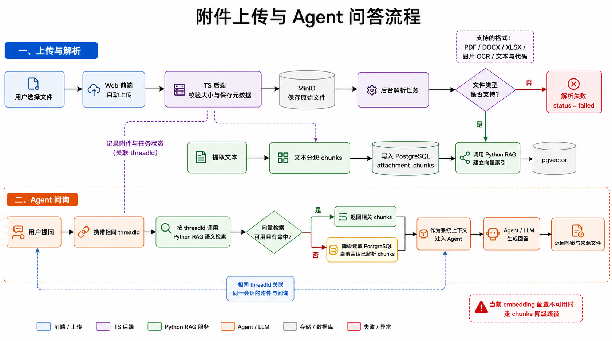

# intelligentAgent

前后端分离的 AI Agent Monorepo，基于 LangChain + LangGraph 构建，支持多 LLM Provider 路由、工具调用、记忆持久化、流式输出和多端交付。

---

## Architecture Overview

```
Browser / Electron / CLI
        │
        ▼
  ┌─────────────┐   container   ┌──────────────┐
  │  Next.js 15  │ ──────────── │  NestJS API   │
  │  :3000       │   /api/chat  │  :8080         │
  │  (SSR proxy) │              │  (SSE stream)  │
  └─────────────┘              └──────┬───────┘
                                      │
                    ┌─────────────────┼─────────────────┐
                    ▼                 ▼                  ▼
           ┌──────────────┐  ┌──────────────┐  ┌──────────────┐
           │  AgentCore    │  │  PostgreSQL   │  │    Redis     │
           │  (LangGraph)  │  │  (checkpoint  │  │  (cache)     │
           │               │  │   + memory)   │  │              │
           └──────┬───────┘  └──────────────┘  └──────────────┘
                  │
          ┌───────┴───────┐
          ▼               ▼
   ┌────────────┐  ┌────────────┐
   │ LLM Provider │  │  Tools     │
   │ (Qwen/GLM/  │  │  (builtin  │
   │  DeepSeek/  │  │  + local   │
   │  OpenAI/    │  │  + MCP)    │
   │  Anthropic) │  │            │
   └────────────┘  └────────────┘
```

### Streaming Pipeline

```
用户输入 → Next.js /api/chat → NestJS /v1/agents/runs/stream
  → AgentCore.invokeEventStream()
    → LangGraph graph.streamEvents(streamMode="messages")
      → on_chat_model_stream (token 级)
        → reasoning_delta (推理过程)
        → text_delta (回答文本)
      → on_tool_start / on_tool_end (工具调用事件)
    → run_end (最终结果)
  → SSE data: {...}
→ Next.js ReadableStream → 浏览器渲染
```

### Attachment And RAG Pipeline



```
用户上传附件
  → Next.js /api/attachments
  → NestJS /v1/attachments
  → MinIO 落盘
  → BullMQ attachment-process
  → AttachmentService.processAttachmentJob()
    → 按文件类型执行文本抽取 / OCR
    → 文本分块并写入 attachment_chunks
    → AttachmentTaskDispatcherService
      → rag-python-service /v1/rag/index/attachments
        → LlamaIndex + pgvector 建索引

用户在同一会话中提问
  → 请求携带与附件相同的 threadId
  → AgentService 调用 rag-python-service /v1/rag/search
    → 有向量命中：返回当前会话的相关 chunks
    → 向量检索不可用或无命中：降级读取 PostgreSQL 中当前会话的 attachment_chunks
  → 检索内容作为系统上下文注入 AgentCore
  → Agent / LLM 生成带来源文件的回答
```

当前可解析格式包括 PDF、DOCX、XLSX、图片 OCR，以及文本和常见代码文件。不支持或无法提取文本的附件会标记为 `failed`。向量检索依赖可用的 embedding 模型配置；配置不可用时，Agent 仍可通过当前会话的已解析 chunks 完成附件问答。

### Event Types

| 事件 | 说明 |
|------|------|
| `run_start` | Agent 开始执行 |
| `model_selected` | 选中的 LLM Provider + 模型 |
| `tools_resolved` | 已注册的工具列表 |
| `tool_start` / `tool_end` | 工具调用开始/结束（含输入输出）|
| `reasoning_delta` | 模型的推理/思考过程（仅推理模型）|
| `text_delta` | LLM 逐 token 输出 |
| `run_end` | 执行完成，含最终输出 |
| `error` | 执行出错 |

---

## Project Structure

```
intelligentAgent/
│
├── core/                          # Agent 核心能力层
│   ├── agent-core-ts/             # TypeScript 实现（主）
│   │   ├── ts/
│   │   │   ├── agent.ts           # AgentCore 类：invoke / invokeEventStream
│   │   │   ├── provider-router.ts # 多 LLM Provider 路由
│   │   │   ├── tools.ts           # 工具注册器（内置 + 本地 + MCP）
│   │   │   ├── events.ts          # AgentRunEvent 事件类型定义
│   │   │   ├── event-stream.ts    # AsyncEventQueue / EventStream
│   │   │   ├── memory.ts          # 记忆存储接口
│   │   │   ├── checkpointer.ts    # 对话检查点管理
│   │   │   ├── skills.ts          # SKILL.md 加载
│   │   │   ├── mcp.ts / mcp-loader.ts  # MCP 插件系统
│   │   │   ├── subagent.ts        # 子 Agent 编排
│   │   │   └── types.ts           # 核心类型
│   │   ├── scripts/
│   │   │   └── fix-imports.mjs    # 编译后补 .js 后缀
│   │   └── test/
│   │
│   └── agent-core-python/         # Python 对等实现（FastAPI 后端用）
│       └── agent_core/
│           ├── runtime.py
│           ├── providers.py
│           ├── tools.py
│           └── memory.py
│
├── backend/                       # 后端服务
│   ├── agent-backend-ts/          # NestJS + Prisma + ioredis（主力）
│   │   └── src/
│   │       ├── agent/             # Agent 控制器 + 服务
│   │       ├── auth/              # 认证（JWT + RSA 加密）
│   │       ├── runtime/           # AgentCore 运行时绑定
│   │       └── infra/             # Prisma / Redis 基础设施
│   │
│   └── agent-backend-python/      # FastAPI + SQLAlchemy（备选）
│
├── frontend/
│   ├── web/                       # Next.js 15 Web 控制台（主力）
│   │   ├── app/
│   │   │   ├── api/chat/route.ts  # 流式转发代理
│   │   │   ├── api/attachments/   # 附件上传与状态代理
│   │   │   ├── api/auth/          # 认证 API
│   │   │   └── (routes)/          # 页面路由
│   │   ├── components/            # UI 组件（login-form, chat 等）
│   │   └── lib/                   # 工具库（crypto, api client）
│   │
│   ├── desktop-electron/          # Electron 桌面端
│   ├── desktop/                   # Tauri 桌面端（备选）
│   └── cli/                       # Ink CLI
│
├── packages/                      # 共享包
│   ├── core-types/                # TypeScript 类型定义
│   ├── sdk-ts/                    # Agent API 客户端 SDK
│   └── ui/                        # 共享 React UI 组件
│
├── skills/                        # Agent 技能（SLILL.md 文件）
├── infra/                         # Docker 部署
│   ├── docker-compose.yml         # PostgreSQL + Redis + MinIO + API + Web
│   ├── Dockerfile.api             # NestJS 后端 Dockerfile
│   ├── Dockerfile.web             # Next.js 前端 Dockerfile
│   ├── entrypoint-api.sh          # API 容器启动脚本
│   └── .env.docker               # Docker 环境变量
│
├── docs/
│   └── streaming-architecture.md  # 流式架构文档
│
├── .env.example                   # 环境变量模板
├── Makefile                       # 常用命令
├── tsconfig.base.json             # TS 基础配置
└── pnpm-workspace.yaml            # pnpm workspace 配置
```

---

## Quick Start

### Prerequisites

- Node.js >= 22
- pnpm >= 10.28
- Docker Desktop（PostgreSQL + Redis + MinIO）
- Python >= 3.11（仅 Python 后端需要）

### One-Command Setup

```bash
cp .env.example .env
make setup
```

等价于：

```bash
docker compose -f infra/docker-compose.yml up -d   # 启动 PostgreSQL + Redis
pnpm install                                         # 安装 TS 依赖
pnpm --filter @intelligent-agent/agent-backend-ts prisma:push  # 初始化数据库
cd backend/agent-backend-python && uv sync --dev    # 安装 Python 依赖
```

### Local Development（每个服务一个终端）

```bash
# 终端 1: TypeScript 后端（NestJS :8080）
make dev-api-ts

# 终端 2: Python 后端（FastAPI :8081）
make dev-api-python

# 终端 3: Web 前端（Next.js :3000）
make dev-web

# 其他）
make dev-cli       # Ink CLI
make dev-desktop   # Electron 桌面端
```

### Docker 部署（全量）

```bash
# 构建并启动所有服务
docker compose -f infra/docker-compose.yml up -d --build

# 访问
open http://localhost:3000   # Web UI
open http://localhost:8080   # API 健康检查

# 默认登录
# 用户名: admin
# 密码:   admin123
```

---

## Configuration

### LLM Provider

支持 6 个 Provider，通过 `AGENT_PROVIDER` 切换默认值：

| Provider | 类型 | 环境变量 | 默认模型 |
|----------|------|----------|----------|
| `qwen` | OpenAI 兼容 | `QWEN_API_KEY`, `QWEN_BASE_URL`, `QWEN_MODEL` | `qwen-plus` |
| `glm` | OpenAI 兼容 | `GLM_API_KEY`, `GLM_BASE_URL`, `GLM_MODEL` | `glm-4.5` |
| `deepseek` | OpenAI 兼容 | `DEEPSEEK_API_KEY`, `DEEPSEEK_BASE_URL`, `DEEPSEEK_MODEL` | `deepseek-chat` |
| `openai` | OpenAI 兼容 | `OPENAI_API_KEY`, `OPENAI_BASE_URL`, `OPENAI_MODEL` | `gpt-4.1-mini` |
| `anthropic` | Anthropic SDK | `ANTHROPIC_API_KEY`, `ANTHROPIC_BASE_URL`, `ANTHROPIC_MODEL` | `claude-3-5-haiku-latest` |
| `gemini` | Python only | `GEMINI_API_KEY`, `GEMINI_BASE_URL`, `GEMINI_MODEL` | `gemini-2.0-flash` |

请求时也可通过 `provider` 和 `model` 参数临时覆盖：

```json
{
  "messages": [{"role": "user", "content": "你好"}],
  "provider": "deepseek",
  "model": "deepseek-reasoner"
}
```

### Key Environment Variables

| 变量 | 默认值 | 说明 |
|------|--------|------|
| `AGENT_PROVIDER` | `qwen` | 默认 LLM Provider |
| `AGENT_SYSTEM_PROMPT` | (内置) | 系统提示词 |
| `AGENT_TEMPERATURE` | `0.2` | LLM 温度 |
| `JWT_SECRET` | `change-me-in-production` | JWT 签名密钥 |
| `AUTH_DEFAULT_USERNAME` | `admin` | 默认登录用户名 |
| `AUTH_DEFAULT_PASSWORD` | `admin123` | 默认登录密码 |
| `AGENT_CHECKPOINTER_BACKEND` | `postgres` | checkpointer 类型（postgres/memory）|
| `AGENT_ENABLED_SKILLS` | `engineering-default` | 启用技能列表 |
| `AGENT_SUBAGENT_MAX_CONCURRENCY` | `2` | 子 Agent 最大并发数 |

---

## Key Features

### 1. Multi-Provider LLM Routing

`provider-router.ts` 通过统一接口管理多个 LLM Provider：

- **OpenAI 兼容**（Qwen / GLM / DeepSeek / OpenAI）：统一使用 `ChatOpenAI`
- **Anthropic**：使用 `ChatAnthropic`
- **自动降级**：支持 API Key 别名（如 `ANTHROPIC_AUTH_TOKEN` 作为 `ANTHROPIC_API_KEY` 的备选）
- **Provider 注册**：支持运行时动态注册自定义 Provider

### 2. Agent Execution

`AgentCore` 使用 `createReactAgent` 构建 LangGraph ReAct Agent：

```
每个请求：
  1. 创建 routed model（根据 provider/model 配置）
  2. 构建工具列表（内置 + 本地 + MCP）
  3. 组装系统提示词（system prompt + 记忆上下文 + 技能上下文）
  4. 创建 LangGraph Agent
  5. 执行（流式或非流式）
  6. 持久化 checkpoint
```

### 3. Tool System

三种工具注册方式，统一通过 `AgentToolRegistry` 管理：

| 方式 | API | 示例 |
|------|-----|------|
| **内置工具** | `registerBuiltinTools(registry)` | `get_time`, `calculate`, `echo_text`, `remember_fact`, `list_memory`, `list_skills`, `read_skill` |
| **本地工具** | `registry.registerLocalTool(spec)` | `read_file`, `write_file`, `execute_command`, `list_files` |
| **MCP 插件** | `registry.useMcpPlugin(plugin)` | 通过 `AGENT_MCP_SERVERS_JSON` 配置的外部 MCP 服务器 |

本地工具示例（`agent.runtime.ts`）：

```typescript
registry.registerLocalTool({
  name: "read_file",
  description: "读取文件内容",
  schema: z.object({
    path: z.string().describe("文件路径"),
    offset: z.number().optional(),
    limit: z.number().optional(),
  }),
  executionMode: "sequential",
  timeoutMs: 10000,
  invoke: async (input) => { /* ... */ },
});
```

### 4. Skill System

从 `skills/`、`.Codex/skills/` 等目录加载 `SKILL.md` 文件，作为 Agent 系统提示词的一部分注入。支持通过 `AGENT_ENABLED_SKILLS` 环境变量启禁用。

### 5. Memory System

基于线程范围（thread-scoped）的"记忆事实"，持久化到 PostgreSQL（`agent_memory_facts` 表），每次调用时作为提示词上下文注入。

### 6. Streaming

通过 `invokeEventStream` 方法支持 SSE 流式输出：

- 使用 LangGraph `streamEvents` 获取 token 级输出
- 支持 `reasoning_delta`（推理过程的思考内容）
- 支持 `tool_start` / `tool_end`（工具调用事件）
- Anthropic 兼容性降级：自动回退到非流式 `invoke`
- 前端通过 `ReadableStream` 逐 token 渲染

### 7. Authentication

- JWT + Bearer Token
- RSA-2048 加密密码传输（前端 Web Crypto API 加密，后端解密）
- 默认用户 `admin` / `admin123`

---

## API Reference

### Authentication

```bash
# 登录
curl -X POST http://localhost:8080/v1/auth/login \
  -H "Content-Type: application/json" \
  -d '{"username":"admin","password":"admin123"}'

# 响应
{"code":0,"data":{"accessToken":"eyJ...","tokenType":"Bearer","expiresIn":"7d"}}
```

### Agent Invocation

```bash
# 非流式调用
curl -X POST http://localhost:8080/v1/agents/runs \
  -H "Content-Type: application/json" \
  -H "Authorization: Bearer $TOKEN" \
  -d '{
    "threadId": "my-thread",
    "messages": [{"role":"user","content":"你好"}]
  }'

# 流式调用（SSE）
curl -N -X POST http://localhost:8080/v1/agents/runs/stream \
  -H "Content-Type: application/json" \
  -H "Authorization: Bearer $TOKEN" \
  -d '{
    "threadId": "my-thread",
    "messages": [{"role":"user","content":"你好"}]
  }'

# 通过前端代理（推荐）
curl -N -X POST http://localhost:3000/api/chat \
  -H "Content-Type: application/json" \
  -H "Authorization: Bearer $TOKEN" \
  -d '{
    "threadId": "my-thread",
    "messages": [{"parts":[{"type":"text","text":"你好"}],"role":"user"}]
  }'
```

### SSE Event Format

```
data: {"type":"run_start","runId":"nest-...","threadId":"...","at":"..."}
data: {"type":"model_selected","provider":"deepseek","model":"deepseek-v4-flash","baseUrl":"...","temperature":0.2,"at":"..."}
data: {"type":"tools_resolved","toolNames":["get_time","echo_text",...],"count":11,"at":"..."}
data: {"type":"reasoning_delta","runId":"...","threadId":"...","text":"Let me think...","at":"..."}  # 仅推理模型
data: {"type":"text_delta","runId":"...","threadId":"...","text":"你","at":"..."}  # 逐 token
data: {"type":"tool_start","toolName":"calculate","input":{...},"threadId":"...","at":"..."}
data: {"type":"tool_end","toolName":"calculate","input":{...},"output":2,"durationMs":5,"threadId":"...","at":"..."}
data: {"type":"run_end","runId":"...","threadId":"...","provider":"deepseek","output":"最终回答","checkpointId":"...","toolCount":11,"at":"..."}
```

---

## Development

### Commands

```bash
make install           # 安装 TS 依赖
make install-python    # 安装 Python 依赖
make db-up             # 启动基础设施容器
make db-down           # 停止基础设施容器
make db-push-ts        # 推送 Prisma schema
make build             # 全量构建
make test              # 全量测试
make lint              # 代码检查
make clean             # 清理
```

### Package Build Order

```bash
pnpm build  # 按依赖顺序编译：
            # core-types → agent-core → sdk-ts → ui → backend → frontend
```

### Testing

```bash
pnpm test                              # 全量测试
pnpm --filter @intelligent-agent/agent-core test   # 单包测试
cd backend/agent-backend-python && uv run pytest -q  # Python 测试
```

---

## Docker Deployment

### Services

| Service | Image | Port | Depends On |
|---------|-------|------|------------|
| `postgres` | pgvector/pgvector:pg16 | 5432 | - |
| `redis` | redis:7 | 6379 | - |
| `minio` | minio/minio | 9000, 9001 | - |
| `api` | infra-api (custom) | 8080 | postgres, redis, minio |
| `web` | infra-web (custom) | 3000 | api |

### Build & Run

```bash
# 全量构建
docker compose -f infra/docker-compose.yml build --no-cache

# 单服务构建
docker compose -f infra/docker-compose.yml build api

# 启动
docker compose -f infra/docker-compose.yml up -d

# 查看日志
docker logs intelligent-agent-api -f
docker logs intelligent-agent-web -f
```

### Environment

Docker 部署使用 `infra/.env.docker`，与本地 `.env` 隔离。关键差异：

- `POSTGRES_HOST=postgres`（Docker DNS）
- `AGENT_API_INTERNAL_URL=http://api:8080`（容器间通信）

---

## FAQ

### 为什么 imports 用 `.js` 后缀？

源文件是 `.ts`，但 `"type": "module"` + `moduleResolution: "Bundler"` 下 tsc 不重写路径。编译后输出 `.js`，Node.js 需要 `.js` 扩展名才能解析。我们通过 `scripts/fix-imports.mjs` 在 tsc 编译后自动补后缀。

### 没有 `.env` 文件怎么办？

```bash
cp .env.example .env
# 编辑填入 API Key
```

### 如何切换 LLM 模型？

两种方式：

1. 环境变量 `AGENT_PROVIDER=deepseek` 切换默认 Provider
2. 请求时传参 `"provider": "anthropic"` 或 `"model": "deepseek-reasoner"` 临时覆盖

### 流式输出不工作？

- 检查网络：Web 容器是否可通过 `http://api:8080` 访问 API
- 检查 Provider：Anthropic 兼容 API 的流式可能有兼容性问题，自动降级到非流式
- 检查日志：`docker logs intelligent-agent-api`

### 文件系统工具的安全风险？

`read_file`, `write_file`, `execute_command` 等工具默认不限制路径。如需沙箱，在工具实现中加入路径白名单检查。

---

## Documentation

| 文档 | 说明 |
|------|------|
| `docs/streaming-architecture.md` | 流式架构 + LangGraph streamEvents + 推理内容输出 |
| `AGENT_CAPABILITIES.md` | 能力矩阵（英文）|
| `AGENT_CAPABILITIES.zh-CN.md` | 能力矩阵（中文）|
| `core/agent-core-ts/README.md` | Agent Core 内部文档 |
