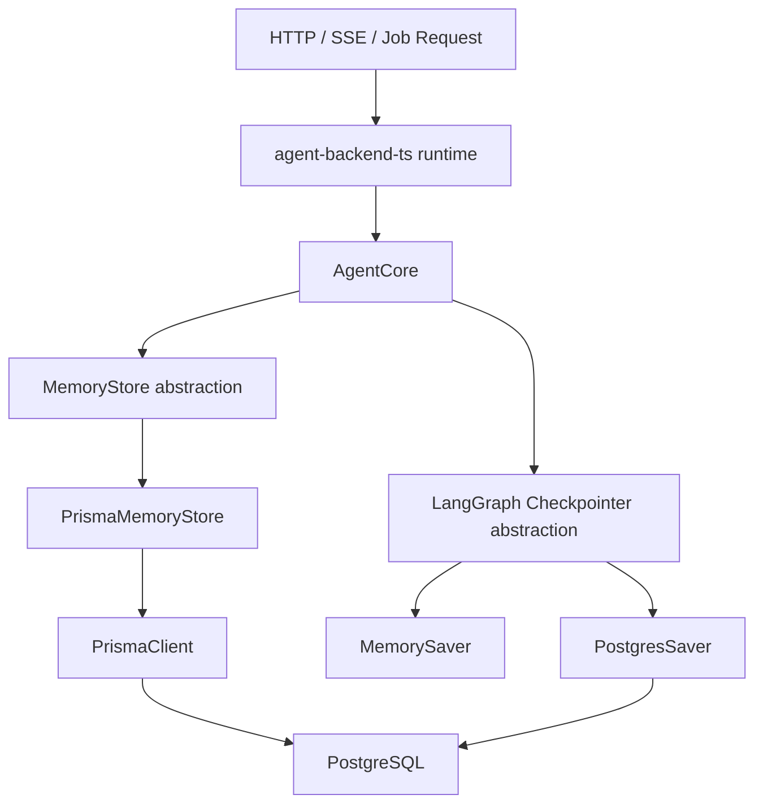

# MemoryStore vs Checkpointer vs Prisma vs PostgreSQL

本文档说明 `intelligentAgent` 当前 TS 后端里这四者各自负责什么，边界在哪里，为什么会同时出现。

## 1. 一句话区分

- `MemoryStore`：负责存“可提炼的记忆事实”
- `Checkpointer`：负责存“LangGraph 运行过程中的会话状态 / checkpoint”
- `Prisma`：负责 TS backend 访问数据库的 ORM / client
- `PostgreSQL`：底层数据库本体

这四者不是同一层概念。

## 2. 先给结论

当前项目里有两类核心持久化数据：

1. `记忆事实`
- 例如用户偏好、约束、长期上下文
- 当前通过 `MemoryStore` 抽象
- TS backend 实际实现是 `PrismaMemoryStore`
- 底层落到 PostgreSQL 表中

2. `会话历史 / checkpoint`
- 例如 LangGraph 每轮执行后的状态、messages、checkpoint 链
- 当前通过 `Checkpointer` 抽象
- TS backend 实际实现是 `PostgresSaver` 或 `MemorySaver`
- 如果是 `PostgresSaver`，底层也落到 PostgreSQL

所以：

- `MemoryStore` 和 `Checkpointer` 都可能最终写 PostgreSQL
- 但它们存的不是一类数据
- 也不是同一套接口

## 3. 关系图



## 4. 四者职责拆解

### 4.1 MemoryStore

定义位置：

- [types.ts](/Users/tangjiaqiang/code/intelligentAgent/core/agent-core-ts/ts/types.ts)
- [memory.ts](/Users/tangjiaqiang/code/intelligentAgent/core/agent-core-ts/ts/memory.ts)

它的职责是：

1. 列出记忆事实
2. 新增记忆事实
3. 删除记忆事实
4. 把记忆事实渲染成 prompt context

当前接口形态大致是：

```ts
listFacts(threadId)
createFact(threadId, input)
deleteFact(threadId, factId)
renderPromptContext(threadId)
```

这说明它处理的是“结构化记忆”，不是完整会话历史。

典型内容：

- 用户偏好
- 项目约束
- 已确认事实
- 需要长期保留的上下文

### 4.2 Checkpointer

定义位置：

- [checkpointer.ts](/Users/tangjiaqiang/code/intelligentAgent/core/agent-core-ts/ts/checkpointer.ts)

它的职责是：

1. 保存 LangGraph 每次运行后的状态
2. 维护 checkpoint 链
3. 支持同一 `thread_id` 的多轮恢复
4. 支持读取 thread/checkpoint 历史

它处理的是：

- messages
- channel values
- checkpoint metadata
- parent checkpoint
- pending writes

所以它是“图运行状态存储”，不是“业务记忆事实存储”。

### 4.3 Prisma

当前 TS backend 的数据库访问层之一。

关键位置：

- [database.service.ts](/Users/tangjiaqiang/code/intelligentAgent/backend/agent-backend-ts/src/infra/database.service.ts)
- [prisma-memory.store.ts](/Users/tangjiaqiang/code/intelligentAgent/backend/agent-backend-ts/src/infra/prisma-memory.store.ts)

它本身不代表某一种数据，而是：

1. 连接数据库
2. 映射表结构
3. 提供类型安全的查询 API

当前项目里，`MemoryStore` 的 TS backend 实现不是直接用 `pg.Pool`，而是走 `PrismaClient`。

### 4.4 PostgreSQL

这是底层数据库。

它不关心：

- 你是在存 memory facts
- 还是在存 LangGraph checkpoints
- 还是在存 attachments / threads / jobs

它只负责最终存储数据。

## 5. 当前项目里的真实落地

## 5.1 记忆事实这条链路

代码入口：

- [agent.runtime.ts](/Users/tangjiaqiang/code/intelligentAgent/backend/agent-backend-ts/src/runtime/agent.runtime.ts)

这里实际注入的是：

```ts
const memoryStore = new PrismaMemoryStore(prisma);
```

也就是说当前 TS backend 里：

- `AgentCore` 拿到的是 `MemoryStore` 抽象
- 实际实现是 `PrismaMemoryStore`
- `PrismaMemoryStore` 再通过 `PrismaClient` 写 PostgreSQL

链路如下：

```text
AgentCore
  -> MemoryStore
  -> PrismaMemoryStore
  -> PrismaClient
  -> PostgreSQL
```

对应文件：

- [agent.runtime.ts](/Users/tangjiaqiang/code/intelligentAgent/backend/agent-backend-ts/src/runtime/agent.runtime.ts)
- [prisma-memory.store.ts](/Users/tangjiaqiang/code/intelligentAgent/backend/agent-backend-ts/src/infra/prisma-memory.store.ts)

## 5.2 会话历史这条链路

代码入口同样在：

- [agent.runtime.ts](/Users/tangjiaqiang/code/intelligentAgent/backend/agent-backend-ts/src/runtime/agent.runtime.ts)

这里初始化的是：

```ts
createCheckpointerManager({
  backend: process.env.AGENT_CHECKPOINTER_BACKEND ?? "postgres",
  connectionString: process.env.POSTGRES_URL ?? ...
})
```

再进入：

- [checkpointer.ts](/Users/tangjiaqiang/code/intelligentAgent/core/agent-core-ts/ts/checkpointer.ts)

这里会选择：

1. `MemorySaver`
2. `PostgresSaver`

如果是 `PostgresSaver`，会直接写 PostgreSQL。

链路如下：

```text
AgentCore
  -> BaseCheckpointSaver
  -> PostgresSaver
  -> PostgreSQL
```

或者：

```text
AgentCore
  -> BaseCheckpointSaver
  -> MemorySaver
  -> process memory
```

## 6. 为什么 `memory.ts` 里看不到 PostgreSQL 地址

因为 [memory.ts](/Users/tangjiaqiang/code/intelligentAgent/core/agent-core-ts/ts/memory.ts) 主要是“能力抽象 + 两种通用实现”，不是当前 backend 的配置装配层。

里面有：

1. `InMemoryMemoryStore`
2. `PostgresMemoryStore`

其中 `PostgresMemoryStore` 是这样定义的：

```ts
constructor(private readonly pool: Pool) {}
```

这说明：

- 它不负责创建数据库连接
- 它只消费一个外部已经准备好的 `pg.Pool`

因此：

- PG 地址
- 用户名密码
- 连接池配置

都不应该写在这个类里。

这部分本来就应该放在上层装配逻辑里。

## 7. 为什么当前 backend 没用 `PostgresMemoryStore`

因为现在 TS backend 统一在走 Prisma 这条数据访问风格。

所以项目没有这样做：

```ts
new PostgresMemoryStore(pool)
```

而是这样做：

```ts
new PrismaMemoryStore(prisma)
```

原因很直接：

1. backend 已经有 Prisma
2. memory facts 表已经纳入 Prisma schema
3. TS 侧希望统一 ORM、统一迁移方式、统一类型

所以 `PostgresMemoryStore` 更像是 core 层保留的一个通用实现，而不是当前 backend 的主实现。

## 8. 数据边界对比表

| 项目 | 负责内容 | 当前实现 | 是否直接依赖 PG 地址 |
| --- | --- | --- | --- |
| `MemoryStore` | 记忆事实 | `PrismaMemoryStore` | 否 |
| `Checkpointer` | 会话状态 / checkpoint | `PostgresSaver` / `MemorySaver` | 间接，初始化时需要 |
| `Prisma` | ORM / DB 访问 | `PrismaClient` | 否，依赖上层配置 |
| `PostgreSQL` | 最终数据存储 | 数据库本体 | 不适用 |

## 9. 常见误区

### 误区 1：会话历史就是 memory

不是。

当前项目里：

- `memory` 是长期保留的结构化事实
- `checkpoint` 是 LangGraph 的运行状态快照

两者用途不同。

### 误区 2：只要用了 PostgreSQL，就是同一套存储接口

不是。

即使都落 PostgreSQL，也可能是两条完全不同的路径：

1. Prisma 管理的业务表
2. LangGraph checkpointer 管理的 checkpoint 表

### 误区 3：`memory.ts` 里一定要有数据库连接地址

不是。

连接地址应该放在：

1. 配置层
2. 模块装配层
3. runtime 初始化层

不应该写死在存储实现类里。

## 10. 最后用一句话总结

在当前项目里：

- `MemoryStore` 管“记忆事实”
- `Checkpointer` 管“会话运行历史”
- `Prisma` 是 TS backend 访问数据库的方式
- `PostgreSQL` 是最终落盘位置

它们会协作，但不是同一个概念，也不应该揉成一层。

## 11. `PostgresMemoryStore` 当前有没有被使用

结论：

- 当前 `intelligentAgent` 的 TS backend **没有实际使用** `PostgresMemoryStore`

仓库中能找到的内容是：

1. `PostgresMemoryStore` 的定义
- [memory.ts](/Users/tangjiaqiang/code/intelligentAgent/core/agent-core-ts/ts/memory.ts)

2. backend 当前真正注入的 memory store
- [prisma-memory.store.ts](/Users/tangjiaqiang/code/intelligentAgent/backend/agent-backend-ts/src/infra/prisma-memory.store.ts)
- [agent.runtime.ts](/Users/tangjiaqiang/code/intelligentAgent/backend/agent-backend-ts/src/runtime/agent.runtime.ts)

当前 runtime 实际代码是：

```ts
const memoryStore = new PrismaMemoryStore(prisma);
```

也就是说，TS backend 当前链路是：

```text
AgentCore
  -> MemoryStore abstraction
  -> PrismaMemoryStore
  -> PrismaClient
  -> PostgreSQL
```

而不是：

```text
AgentCore
  -> PostgresMemoryStore
  -> pg.Pool
  -> PostgreSQL
```

### 11.1 `PostgresMemoryStore` 留着的意义

它仍然是有价值的，只是当前 backend 没选它。

适合的场景是：

1. 想直接在别的 Node 服务里复用 `agent-core-ts`
2. 不想引入 Prisma
3. 只想注入一个原生 `pg.Pool`
4. 希望 memory 层走原生 SQL 而不是 ORM

典型使用方式会是：

```ts
import { Pool } from "pg";
import { AgentCore, PostgresMemoryStore } from "@intelligent-agent/agent-core";

const pool = new Pool({ connectionString: process.env.POSTGRES_URL });
const memoryStore = new PostgresMemoryStore(pool);

const core = new AgentCore({
  memoryStore
});
```

### 11.2 为什么当前 backend 没选它

因为当前 TS backend 已经有一整套 Prisma 基础设施：

1. Prisma schema 已管理 memory facts 表
2. PrismaClient 已作为统一数据库访问入口
3. backend 希望 ORM、迁移、类型都走同一套链路

所以当前选择 `PrismaMemoryStore` 更一致。
