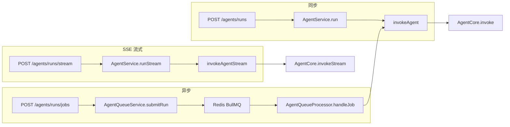
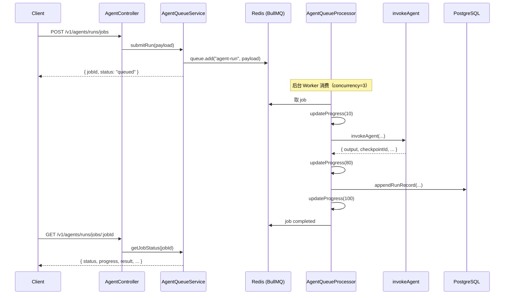

# Agent Backend 模块详解（`src/agent`）

> **文档信息**
>
> | 字段 | 值 |
> |------|-----|
> | 创建日期 | 2026-06-09 |
> | 源码路径 | `backend/agent-backend-ts/src/agent/` |
> | 目标读者 | 需要理解 NestJS Agent Gateway 与 BullMQ 异步队列的开发者 |
> | 相关文档 | `docs/yunfan/2026-06-09-agent-core-architecture-learning-guide.md` |

---

## 目录

1. [模块定位与分层](#1-模块定位与分层)
2. [目录结构与文件职责](#2-目录结构与文件职责)
3. [Agent 执行的三种模式](#3-agent-执行的三种模式)
4. [核心文件详解](#4-核心文件详解)
5. [BullMQ 异步队列](#5-bullmq-异步队列)
6. [模型配置子模块](#6-模型配置子模块)
7. [HTTP API 速查](#7-http-api-速查)
8. [完整数据流](#8-完整数据流)
9. [与 Core / Runtime 的关系](#9-与-core--runtime-的关系)
10. [设计要点与注意点](#10-设计要点与注意点)
11. [本地调试示例](#11-本地调试示例)

---

## 1. 模块定位与分层

`src/agent/` 是 NestJS 后端的 **Agent Gateway 层**，职责是：

- 接收 HTTP / SSE 请求，校验 DTO
- 编排同步、流式、异步三种执行路径
- 管理 Redis 结果缓存、Prisma 运行记录
- 通过 BullMQ 解耦长耗时 Agent 任务
- 暴露线程、记忆、技能、MCP、模型配置等 REST API

**它不做的事：** 不直接组装 LangGraph，不实现 Provider 路由——这些委托给 `src/runtime/agent.runtime.ts` → `@intelligent-agent/agent-core`。

```
┌─────────────────────────────────────────────────────────────┐
│  Frontend / CLI / SDK                                        │
└──────────────────────────┬──────────────────────────────────┘
                           │ HTTP / SSE
┌──────────────────────────▼──────────────────────────────────┐
│  src/agent/  ← 本文档范围                                     │
│  AgentController / AgentService / AgentQueue* / ModelConfig  │
└──────────────────────────┬──────────────────────────────────┘
                           │
          ┌────────────────┼────────────────┐
          ▼                ▼                ▼
   agent.runtime.ts   Redis (缓存)    Prisma (业务表)
          │
          ▼
   @intelligent-agent/agent-core (AgentCore)
```

---

## 2. 目录结构与文件职责

```
src/agent/
├── agent.controller.ts       # HTTP 路由（REST + SSE）
├── agent.service.ts          # 业务编排：同步 / 流式 / 查询
├── agent.dto.ts              # 请求体验证（class-validator）
├── agent.payload.ts          # threadId / prompt 解析工具
├── agent-queue.service.ts    # BullMQ 生产者（入队）
├── agent-queue.processor.ts  # BullMQ 消费者（Worker）
├── model-config.controller.ts # 模型配置 + 内置 Provider API
├── model-config.service.ts   # 模型配置 CRUD 业务逻辑
└── model-config.dto.ts       # 模型配置 DTO + getBuiltinProviders()
```

| 文件 | 类型 | 职责 |
|------|------|------|
| `agent.controller.ts` | Controller | 定义 `/v1/agents/*`、`/v1/threads/*` 等路由 |
| `agent.service.ts` | Service | 同步/流式执行、缓存、透传 Core 查询 |
| `agent.dto.ts` | DTO | `AgentRunDto`、记忆/MCP/路径参数校验 |
| `agent.payload.ts` | 工具 | `resolveThreadId()`、`resolvePrompt()` |
| `agent-queue.service.ts` | Service | 3 条 BullMQ 队列的生产者 + Job 状态查询 |
| `agent-queue.processor.ts` | Provider | NestJS 启动时注册 3 个 Worker |
| `model-config.*` | 子模块 | DB 管理 LLM Provider 配置（apiKey/baseUrl/model） |

**模块注册（`app.module.ts`）：**

```typescript
controllers: [AgentController, ModelConfigController, ProviderController, ...]
providers: [AgentService, AgentQueueService, AgentQueueProcessor, ModelConfigService, ...]
```

---

## 3. Agent 执行的三种模式

| 模式 | HTTP 接口 | 实现入口 | 阻塞 | 缓存 | 进度 |
|------|-----------|----------|------|------|------|
| **同步** | `POST /v1/agents/runs` | `AgentService.run()` | ✅ 阻塞至完成 | ✅ Redis | ❌ |
| **SSE 流式** | `POST /v1/agents/runs/stream` | `AgentService.runStream()` | ✅ 连接保持 | ✅ Redis | 事件流 |
| **异步队列** | `POST /v1/agents/runs/jobs` | `AgentQueueService` + Worker | ❌ 立即返回 jobId | ❌ | 轮询 progress |

三种模式最终都调用 `agent.runtime.ts` 的 `invokeAgent()` / `invokeAgentStream()`，区别在**是否阻塞 HTTP**以及**是否经 BullMQ 解耦**。



---

## 4. 核心文件详解

### 4.1 `agent.payload.ts` — 请求归一化

三种执行路径共用，保证 threadId / prompt 解析一致。

```typescript
resolveThreadId(payload, fallback)
// 优先级：threadId → sessionId → fallback

resolvePrompt(payload)
// 优先级：messages 最后一条 content → message 字段 → 空字符串
```

**示例：**

```json
{ "threadId": "conv-001", "message": "你好" }
{ "sessionId": "conv-001", "messages": [{ "role": "user", "content": "你好", "createdAt": "..." }] }
```

### 4.2 `agent.dto.ts` — 输入校验

`AgentRunDto` 主要字段：

| 字段 | 类型 | 说明 |
|------|------|------|
| `threadId` / `sessionId` | string? | 会话标识，二选一 |
| `message` | string? | 简写单条消息 |
| `messages` | ChatMessageDto[]? | 标准消息数组 |
| `provider` | Provider? | qwen / glm / openai / deepseek / ... |
| `model` | string? | 模型名 |
| `enabledSkills` | string[]? | 启用的技能 |
| `metadata` | object? | 透传给 AgentCore |

全局 `ValidationPipe` 在 Controller 层自动校验（whitelist + transform）。

### 4.3 `agent.service.ts` — 业务核心

#### 同步 `run()` 流程

```
1. resolveThreadId / resolvePrompt
2. 构建 Redis 缓存 key：
   agent:run:{provider}:{model}:{threadId}:{prompt}
3. 缓存命中 → 直接返回（cached=true, checkpointId=null）
4. 未命中 → invokeAgent() → AgentCore.invoke()
5. db.appendRunRecord() 写入 agent_runs 表
6. redis.setCachedOutput() 缓存结果（TTL 120s）
7. 返回 AgentRunResponse
```

#### 流式 `runStream()` 流程

```
1. 同样检查 Redis 缓存（命中则伪造 run_start + run_end 事件）
2. for await (invokeAgentStream()) → 逐条回调 onEvent
3. 收到 run_end 后写 agent_runs + Redis
4. 未收到 run_end 则抛错
```

#### 其他透传方法

| 方法 | 底层 |
|------|------|
| `listThreads` / `getThread` | `listRuntimeThreads` / `getRuntimeThread` → Checkpointer |
| `listMemory` / `createMemory` / `deleteMemory` | MemoryStore（PrismaMemoryStore） |
| `listSkills` / `getSkill` | SkillRegistry |
| `listMcpPlugins` / `listMcpTools` / `invokeMcpTool` | AgentCore MCP API |
| `submitRun` / `getJobStatus` | 委托 `AgentQueueService` |

#### 生命周期

```typescript
async onModuleDestroy() {
  await shutdownAgentRuntime();  // 关闭 Checkpointer 连接
}
```

### 4.4 `agent.controller.ts` — HTTP 路由

**Agent 执行：**

| 方法 | 路径 | 说明 |
|------|------|------|
| POST | `/v1/agents/runs` | 同步执行 |
| POST | `/v1/agents/runs/stream` | SSE，`Content-Type: text/event-stream` |
| POST | `/v1/agents/runs/jobs` | 异步入队 |
| GET | `/v1/agents/runs/jobs/:jobId` | 查询 Job 状态 |

**SSE 写法要点：**

```typescript
res.setHeader("Content-Type", "text/event-stream; charset=utf-8");
res.write(`data: ${JSON.stringify(event)}\n\n`);
```

---

## 5. BullMQ 异步队列

BullMQ 基于 **Redis**，采用 **Producer（Queue）+ Consumer（Worker）** 模式。

### 5.1 三条队列总览

| 队列名 | 用途 | 生产者 | Worker concurrency | 主要调用方 |
|--------|------|--------|-------------------|-----------|
| `agent-run` | 单次 Agent 异步执行 | `submitRun()` | 3 | `AgentService.submitRun()` |
| `agent-subrun` | 子代理异步执行 | `submitSubrun()` | 2 | `SubagentService` |
| `attachment-process` | 附件解析（PDF/Word/OCR） | `submitAttachmentProcessJob()` | 2 | `AttachmentService` |

**生产者（`agent-queue.service.ts`）：**

```typescript
constructor(@Inject(REDIS_MODULE_OPTIONS) options: RedisModuleOptions) {
  const { host, port } = options;
  this.queue = new Queue("agent-run", { connection: { host, port } });
  this.subrunQueue = new Queue("agent-subrun", { connection: { host, port } });
  this.attachmentQueue = new Queue("attachment-process", { connection: { host, port } });
}
```

**消费者（`agent-queue.processor.ts`，`OnModuleInit` 启动）：**

```typescript
this.worker = new Worker("agent-run", handleJob, { connection, concurrency: 3 });
this.subrunWorker = new Worker("agent-subrun", handleSubrunJob, { connection, concurrency: 2 });
this.attachmentWorker = new Worker("attachment-process", ..., { connection, concurrency: 2 });
```

### 5.2 Agent Run 异步完整流程



### 5.3 入队配置

```typescript
await this.queue.add("agent-run", { ...payload, submittedAt }, {
  removeOnComplete: 50,   // 保留最近 50 个已完成 job
  removeOnFail: 100       // 保留最近 100 个失败 job
});
```

### 5.4 Worker：`handleJob` 逻辑

```typescript
// agent-queue.processor.ts
private async handleJob(job: Job<AgentRunDto>) {
  const threadId = resolveThreadId(payload, `thread-${job.id}-${Date.now()}`);
  const runId = `job-${job.id}-${Date.now()}`;

  await job.updateProgress(10);
  const runtimeResult = await invokeAgent({ prompt, threadId, runId, ... });
  await job.updateProgress(80);
  await this.db.appendRunRecord({ runId, threadId, output, checkpointId, ... });
  await job.updateProgress(100);
}
```

**Worker：`handleSubrunJob` 逻辑**

- 调用 `invokeAgentSubrun()`
- 写入 `appendSubagentRunRecord()`
- 返回 `subrun` 对象作为 `job.returnvalue`

**Worker：附件处理**

- 调用 `attachmentService.processAttachmentJob(attachmentId)`
- progress: 10 → 100

### 5.5 Job 状态查询

```typescript
async getJobStatus(jobId: string) {
  const job = await this.queue.getJob(jobId);
  return {
    jobId: String(job.id),
    status: await job.getState(),  // waiting | active | completed | failed | delayed | ...
    progress: job.progress,         // 0-100
    result: job.returnvalue,        // Worker 返回值（agent-run 多为 null）
    failedReason: job.failedReason,
    createdAt: new Date(job.timestamp).toISOString(),
    finishedAt: job.finishedOn ? new Date(job.finishedOn).toISOString() : null
  };
}
```

### 5.6 三种模式对比

| 维度 | 同步 `run()` | SSE `runStream()` | 异步 Worker |
|------|-------------|-------------------|-------------|
| HTTP 阻塞 | 是 | 连接保持 | 否 |
| Redis 结果缓存 | ✅ | ✅ | ❌ |
| 错误处理 | 吞异常，返回 error 字符串 | 抛异常 / SSE error 事件 | job 标记 failed |
| runId 前缀 | `nest-{ts}` | `nest-{ts}` | `job-{jobId}-{ts}` |
| threadId fallback | `thread-{ts}` | `thread-{ts}` | `thread-{jobId}-{ts}` |
| 进度反馈 | 无 | 事件流 | progress 0/10/80/100 |
| 结果查法 | 响应体 | SSE run_end | 轮询 job + agent_runs 表 |

### 5.7 为什么用 BullMQ？

1. **长任务解耦**：Agent 调用可能 30s+，HTTP 不宜长时间阻塞
2. **并发控制**：`concurrency: 3` 限制同时运行的 Agent 数，保护 LLM API 配额
3. **进度追踪**：`updateProgress()` 供前端轮询展示
4. **失败隔离**：Worker 异常不拖垮 HTTP 请求线程
5. **统一基础设施**：Agent Run、Subagent、附件处理共用 Redis

---

## 6. 模型配置子模块

管理 LLM Provider 的数据库配置，支持 Web 控制台动态切换模型，无需改环境变量。

### 6.1 数据模型（Prisma `model_configs`）

| 字段 | 说明 |
|------|------|
| `name` | 配置名称（同 provider 下唯一） |
| `provider` | qwen / glm / deepseek / openai / 自定义 |
| `model` | 模型 ID |
| `apiKey` | API 密钥 |
| `baseUrl` | API 地址 |
| `isActive` | 是否当前激活（全局仅一个 true） |
| `isCustom` | 是否非内置 Provider |

### 6.2 API

| 方法 | 路径 | 功能 |
|------|------|------|
| GET | `/v1/model-configs` | 列出所有配置 |
| GET | `/v1/model-configs/active` | 当前激活配置 |
| GET | `/v1/model-configs/:id` | 单条详情 |
| POST | `/v1/model-configs` | 创建（首个自动激活） |
| PUT | `/v1/model-configs/:id` | 更新 |
| DELETE | `/v1/model-configs/:id` | 删除（若删激活项则激活最早一条） |
| POST | `/v1/model-configs/:id/activate` | 切换激活 |
| GET | `/v1/providers` | 内置 Provider 列表及默认 baseUrl/model |

### 6.3 与 Agent 执行的联动

请求未指定 `provider` / `model` 时，`agent.runtime.ts` 的 `invokeAgent()` 会：

```typescript
const activeConfig = await getActiveModelConfig(prisma);
if (activeConfig) {
  provider = activeConfig.provider;
  model = activeConfig.model;
  providerConfigs = {
    [activeConfig.provider]: {
      apiKey: activeConfig.apiKey,
      baseUrl: activeConfig.baseUrl,
      model: activeConfig.model
    }
  };
}
```

---

## 7. HTTP API 速查

### 7.1 Agent 执行

| 方法 | 路径 | 说明 |
|------|------|------|
| POST | `/v1/agents/runs` | 同步执行 |
| POST | `/v1/agents/runs/stream` | SSE 流式（仅 TS Backend） |
| POST | `/v1/agents/runs/jobs` | BullMQ 异步入队（仅 TS Backend） |
| GET | `/v1/agents/runs/jobs/:jobId` | 查询异步 Job 状态 |

### 7.2 运行记录与线程

| 方法 | 路径 | 说明 |
|------|------|------|
| GET | `/v1/runs/:runId` | 单次运行记录（Prisma） |
| GET | `/v1/threads` | 线程列表（Checkpointer） |
| GET | `/v1/threads/:threadId` | 线程详情 + checkpoints |
| GET | `/v1/threads/:threadId/checkpoints` | 同上（别名路由） |

### 7.3 记忆

| 方法 | 路径 |
|------|------|
| GET | `/v1/threads/:threadId/memory` |
| POST | `/v1/threads/:threadId/memory/facts` |
| DELETE | `/v1/threads/:threadId/memory/facts/:factId` |

### 7.4 技能与 MCP

| 方法 | 路径 |
|------|------|
| GET | `/v1/skills` |
| GET | `/v1/skills/:skillName` |
| GET | `/v1/mcp/plugins` |
| GET | `/v1/mcp/tools` |
| POST | `/v1/mcp/tools/:toolName/invoke` |

### 7.5 模型配置

见 [§6.2](#62-api)。

---

## 8. 完整数据流

### 8.1 同步模式

```
HTTP POST /v1/agents/runs
    │
    ▼
AgentController.run(AgentRunDto)
    │  ValidationPipe 校验
    ▼
AgentService.run()
    ├─ resolveThreadId / resolvePrompt
    ├─ Redis.getCachedOutput() ──命中──► 返回 cached 响应
    │
    ▼ 未命中
invokeAgent()  [agent.runtime.ts]
    ├─ getActiveModelConfig()（可选）
    └─ AgentCore.invoke()
         ├─ Provider 路由
         ├─ 工具构建 + LangGraph ReAct
         └─ Checkpointer 存档
    │
    ▼
AgentService
    ├─ db.appendRunRecord()     → agent_runs 表
    ├─ redis.setCachedOutput()  → TTL 120s
    └─ AgentRunResponse
```

### 8.2 Redis 缓存 Key 规则

```
agent:run:{provider}:{model}:{threadId}:{lastMessage}
```

- 相同 provider + model + thread + 相同 prompt → 120s 内直接返回缓存
- 缓存命中时 `checkpointId=null`，**不会触发 Agent 执行**，多轮对话需注意

### 8.3 业务表 vs Checkpointer

| 存储 | 表/机制 | 内容 | 用途 |
|------|---------|------|------|
| `agent_runs` | Prisma | prompt、output、checkpointId 引用 | 运行审计、Run 列表 |
| Checkpointer | LangGraph PostgresSaver | 完整 messages 状态链 | 多轮对话恢复 |
| `agent_memory_facts` | Prisma | 结构化记忆事实 | Prompt 注入 |
| BullMQ | Redis | Job 队列与状态 | 异步任务 |

---

## 9. 与 Core / Runtime 的关系

```
src/agent/agent.service.ts
    │
    ├─ invokeAgent()          ──► src/runtime/agent.runtime.ts
    ├─ invokeAgentStream()    ──► src/runtime/agent.runtime.ts
    ├─ listRuntimeThreads()   ──► AgentCore.listThreads()
    ├─ listRuntimeMemoryFacts() ──► AgentCore.listMemoryFacts()
    └─ ...

src/runtime/agent.runtime.ts
    │
    ├─ createCheckpointerManager()
    ├─ new AgentCore({ checkpointSaver, memoryStore, toolRegistry, ... })
    └─ invokeAgent() → core.invoke() + getActiveModelConfig()
```

**Runtime 单例：** `getAgentRuntime(prisma)` 懒初始化，全进程共享一个 `AgentCore` 实例。

---

## 10. 设计要点与注意点

### 优点

- Controller / Service / Queue 职责清晰，三种执行模式复用 `resolvePrompt` / `invokeAgent`
- BullMQ 与 Redis 缓存共用同一 Redis 实例
- ModelConfig 支持 DB 动态切换 LLM
- DTO 校验 + 统一 payload 解析，减少重复逻辑

### 需注意

1. **异步 Job 无 Redis 结果缓存**：仅同步和 SSE 走缓存
2. **`handleJob` 无 returnvalue**：`getJobStatus().result` 可能为 null，完整结果在 `agent_runs` 表（通过 runId 查）
3. **Worker 与 HTTP 同进程**：Worker 嵌在 NestJS 内；多实例部署时 BullMQ 自动竞争消费，但 concurrency 为每实例独立
4. **附件 Worker 耦合在 agent 目录**：`AgentQueueProcessor` 还处理 `attachment-process`，跨模块依赖 `AttachmentService`
5. **同步模式吞异常**：`run()` 失败时返回 error 字符串而非 HTTP 5xx，客户端需检查 output 内容
6. **缓存与多轮对话**：相同 prompt 命中缓存会跳过 Agent 执行，开发调试时可缩短 TTL 或换 prompt

---

## 11. 本地调试示例

### 11.1 同步执行

```bash
# 获取 Token
curl -X POST http://127.0.0.1:8080/v1/auth/token \
  -H "Content-Type: application/json" \
  -d '{"userId":"demo"}'

# 同步 Run
curl -X POST http://127.0.0.1:8080/v1/agents/runs \
  -H "Authorization: Bearer <token>" \
  -H "Content-Type: application/json" \
  -d '{
    "threadId": "test-thread-001",
    "message": "现在几点？用工具回答"
  }'
```

### 11.2 SSE 流式

```bash
curl -N -X POST http://127.0.0.1:8080/v1/agents/runs/stream \
  -H "Authorization: Bearer <token>" \
  -H "Content-Type: application/json" \
  -d '{
    "threadId": "test-thread-001",
    "message": "计算 (12+3)*4"
  }'
```

### 11.3 异步 Job

```bash
# 提交
curl -X POST http://127.0.0.1:8080/v1/agents/runs/jobs \
  -H "Authorization: Bearer <token>" \
  -H "Content-Type: application/json" \
  -d '{"message": "你好"}'
# → { "jobId": "1", "status": "queued" }

# 轮询
curl http://127.0.0.1:8080/v1/agents/runs/jobs/1 \
  -H "Authorization: Bearer <token>"
# → { "status": "completed", "progress": 100, ... }
```

### 11.4 启动依赖

```bash
make setup          # Docker: PostgreSQL + Redis
make dev-api-ts     # NestJS :8080
```

环境变量：`REDIS_URL` / `POSTGRES_URL`、`AGENT_PROVIDER`、`QWEN_API_KEY` 等。

---

## 附录 A：源码文件索引

| 文件 | 行数级 | 说明 |
|------|--------|------|
| `agent.controller.ts` | ~170 | REST + SSE 路由 |
| `agent.service.ts` | ~340 | 业务编排 |
| `agent-queue.service.ts` | ~130 | BullMQ 生产者 |
| `agent-queue.processor.ts` | ~175 | BullMQ 消费者 |
| `agent.dto.ts` | ~200 | DTO 校验 |
| `agent.payload.ts` | ~40 | 解析工具 |
| `model-config.service.ts` | ~140 | 模型配置 CRUD |
| `../runtime/agent.runtime.ts` | ~330 | AgentCore 装配与 invoke 封装 |
| `../subagent/subagent.service.ts` | — | 使用 `submitSubrun()` |
| `../attachment/attachment.service.ts` | — | 使用 `submitAttachmentProcessJob()` |

## 附录 B：相关文档

| 文档 | 路径 |
|------|------|
| Agent Core 架构 | `docs/yunfan/2026-06-09-agent-core-architecture-learning-guide.md` |
| Checkpointer 详解 | `docs/yunfan/2026-06-09-checkpointer-manager-guide.md` |
| 存储职责边界 | `backend/agent-backend-ts/STORAGE_RESPONSIBILITIES.zh-CN.md` |
| LangGraph API 落点 | `backend/agent-backend-ts/LANGGRAPH_APIS.zh-CN.md` |
| Agent 能力清单 | `AGENT_CAPABILITIES.zh-CN.md` |

---

*本文档基于 2026-06-09 代码库状态整理。*
