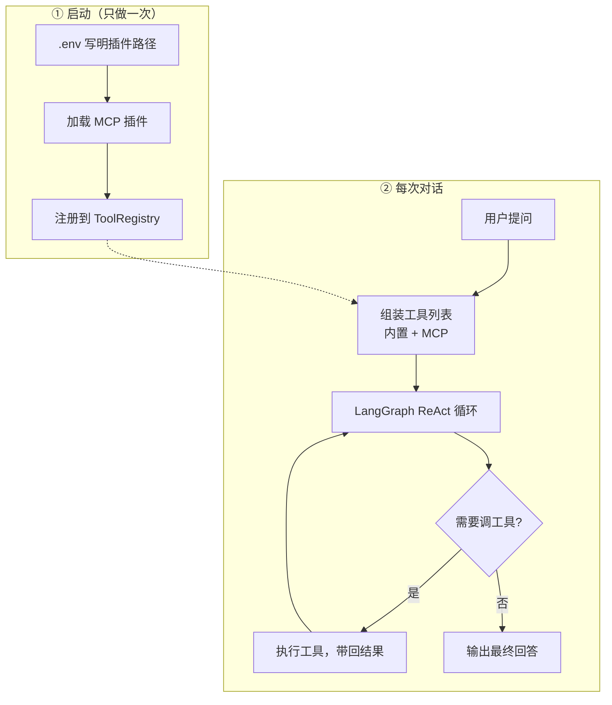

# MCP 实现代码走读（入门版）

> **文档信息**
>
> | 字段 | 值 |
> |------|-----|
> | 创建日期 | 2026-06-09 |
> | 目标读者 | 刚入门的 Agent 开发工程师 |
> | 源码范围 | `core/agent-core-ts` + `backend/agent-backend-ts` |
> | 阅读顺序 | 建议按本文「第 3 节」文件顺序对照源码 |

---

## 目录

1. [先搞懂：这个项目里的 MCP 是什么](#1-先搞懂这个项目里的-mcp-是什么)
2. [整体流程：从启动到 LLM 调工具](#2-整体流程从启动到-llm-调工具)
3. [逐文件代码分析（按执行顺序）](#3-逐文件代码分析按执行顺序)
4. [两条使用路径对比](#4-两条使用路径对比)
5. [HTTP API 完整说明](#5-http-api-完整说明)
6. [Core 层 API 速查](#6-core-层-api-速查)
7. [手写一个 MCP 插件](#7-手写一个-mcp-插件)
8. [初学者常见问题](#8-初学者常见问题)

---

## 1. 先搞懂：这个项目里的 MCP 是什么

### 1.1 两个「MCP」不要混

| 名称 | 是什么 | 本项目有没有 |
|------|--------|-------------|
| **行业标准 MCP** | Anthropic 的 Model Context Protocol，独立 Server 进程，JSON-RPC 通信 | Python 侧部分支持（`AGENT_MCP_SERVERS_JSON`） |
| **本项目的 MCP 插件** | 一套 TypeScript **接口约定**（`McpToolPlugin`），用来动态加载外部工具 | ✅ TS 主路径 |

你可以把本项目的 MCP 理解成：**「可插拔的外部工具包」**——写成一个模块，配环境变量，Agent 启动时自动加载，LLM 就能调用里面的工具。

### 1.2 MCP 工具和内置工具有什么区别？

```
内置工具（get_time、calculate...）  → 写在 tools.ts 里，随 Core 发布
Local Tool（registerLocalTool）      → 业务代码里注册，同进程
MCP 插件工具（McpToolPlugin）         → 独立 .mjs 文件，动态 import，可热插拔
```

对 LLM 来说，**三种工具看起来一样**——都是 `StructuredTool`（有 name、description、schema）。区别只在「工具从哪来、怎么加载」。

### 1.3 涉及的核心文件一张表

| 文件 | 职责 |
|------|------|
| `core/agent-core-ts/ts/types.ts` | 类型定义：`McpToolPlugin`、`McpToolInfo` 等 |
| `core/agent-core-ts/ts/mcp.ts` | 工具工厂：`createMcpTool`、`StaticMcpToolPlugin` |
| `core/agent-core-ts/ts/mcp-loader.ts` | 从环境变量动态 import 插件 |
| `core/agent-core-ts/ts/tools.ts` | 工具注册表：合并内置 + local + MCP |
| `core/agent-core-ts/ts/agent.ts` | AgentCore：invoke 时 buildTools + MCP 查询/直调 API |
| `core/agent-core-ts/ts/utils/tool-execution.ts` | 工具执行包装：超时、事件 |
| `backend/.../agent.runtime.ts` | Backend 启动时装配 MCP |
| `backend/.../agent.controller.ts` | HTTP 路由 |
| `backend/.../agent.service.ts` | HTTP 业务层 |

---

## 2. 整体流程：从启动到 LLM 调工具

### 2.1 生命周期概览

```
【启动阶段 · 只做一次】
  .env: AGENT_MCP_PLUGIN_MODULES=./my-plugin.mjs
       ↓
  loadMcpPluginsFromEnv()          ← mcp-loader.ts
       ↓
  registry.useMcpPlugin(plugin)    ← tools.ts
       ↓
  new AgentCore({ toolRegistry, mcpServices: { prisma } })

【每次 Agent 调用】
  AgentCore.invoke({ prompt, threadId })
       ↓
  registry.buildTools({ threadId, mcpServices, toolAllowlist })
       ↓
  每个 plugin.loadTools({ invocationContext, services })
       ↓
  合并所有工具 → wrapToolWithPolicy（超时/事件）
       ↓
  createReactAgent({ tools }) → LangGraph ReAct
       ↓
  LLM 决定调哪个工具 → tool.invoke(args) → 返回结果
```

### 2.2 架构图

一句话：**启动时把 MCP 插件注册进工具表，对话时 LLM 按需调用这些工具。**



| 图上步骤 | 对应模块 | 关键文件 |
|---------|---------|---------|
| 加载 MCP 插件 | 加载层 | `mcp-loader.ts` |
| 注册到 ToolRegistry | 注册层 | `tools.ts` |
| 组装工具列表 | 核心层 | `agent.ts` → `buildTools()` |
| ReAct 循环 | LangGraph | `createReactAgent` |
| HTTP 查询/直调 MCP | 网关层 | `agent.controller.ts`（旁路 API，不进主循环） |

---

## 3. 逐文件代码分析（按执行顺序）

---

### 3.1 `types.ts` — 先认类型

路径：`core/agent-core-ts/ts/types.ts`

这是 MCP 相关的「契约」，Backend 和 Core 都依赖这些类型。

#### `ToolInvocationContext` — 工具调用上下文

```typescript
export interface ToolInvocationContext {
  threadId?: string;   // 当前对话线程
  runId?: string;      // 当前这次执行
  metadata?: Record<string, unknown>;  // 额外元数据（如 user_id）
}
```

**作用：** 告诉工具「现在是哪次对话、哪次 run」。MCP 插件可以根据 threadId 返回不同工具，或做权限判断。

#### `McpServiceMap` — 业务依赖注入

```typescript
export type McpServiceMap = Record<string, unknown>;
```

**作用：** Backend 把 `prisma` 等业务对象通过这个 map 传给插件，插件**不需要** import Backend 代码。

#### `McpToolPluginLoadContext` — 加载插件时的入参

```typescript
export interface McpToolPluginLoadContext {
  invocationContext: ToolInvocationContext;
  services?: McpServiceMap;
}
```

#### `McpToolPlugin` — 插件核心接口（最重要）

```typescript
export interface McpToolPlugin {
  name: string;   // 插件名，如 "weather-plugin"
  loadTools: (context?: McpToolPluginLoadContext) => Promise<StructuredToolInterface[]>;
}
```

**理解：**

- 一个插件 = 一个 `name` + 一个 `loadTools` 函数
- `loadTools` 返回 LangChain 的 `StructuredToolInterface[]`（工具数组）
- **为什么是函数而不是静态数组？** 因为每次调用可以带上不同的 `threadId`、`services`

#### `McpPluginInfo` / `McpToolInfo` — 查询结果

```typescript
export interface McpPluginInfo {
  name: string;
}

export interface McpToolInfo {
  plugin: string;      // 来自哪个插件
  name: string;        // 工具名
  description: string; // 工具描述（LLM 靠它决定要不要调）
}
```

#### `AgentToolRegistry` — 注册表接口

```typescript
export interface AgentToolRegistry {
  useMcpPlugin(plugin: McpToolPlugin): this;
  listMcpPlugins?(): McpPluginInfo[];
  buildMcpTools?(context?: McpToolPluginLoadContext): Promise<Array<{ plugin: string; tool: StructuredToolInterface }>>;
  buildTools(options?: BuildToolOptions): Promise<StructuredToolInterface[]>;
  // ... 还有 registerLocalTool、registerStructuredTool
}
```

---

### 3.2 `mcp.ts` — 把描述变成 LangChain 工具

路径：`core/agent-core-ts/ts/mcp.ts`

这个文件做两件事：**帮插件作者简化写工具**，以及提供一个**静态插件类**。

#### `McpToolDescriptor` — 工具描述（比直接写 LangChain tool 更简单）

```typescript
export interface McpToolDescriptor<TSchema extends z.ZodTypeAny> {
  name: string;           // 工具名，LLM 可见
  description: string;    // 工具说明，LLM 靠它理解用途
  schema: TSchema;        // Zod schema，定义参数格式
  invoke: (input, context) => Promise<unknown> | unknown;  // 真正执行的函数
}
```

**类比：** 就像填一张表——name、description、参数格式、执行逻辑。

#### `createMcpTool()` — 工厂函数

```typescript
export function createMcpTool(descriptor, context = {}, services?) {
  return tool(
    async (input) => {
      const result = await descriptor.invoke(input, { ...context, services });
      return toDisplayString(result);  // 统一转成字符串给 LLM
    },
    {
      name: descriptor.name,
      description: descriptor.description,
      schema: descriptor.schema
    }
  );
}
```

**逐行理解：**

1. 用 LangChain 的 `tool()` 包装
2. 调用时执行 `descriptor.invoke`，并把 `context` + `services` 传进去
3. 结果用 `toDisplayString` 转成 LLM 可读的字符串
4. 返回标准的 `StructuredToolInterface`

#### `StaticMcpToolPlugin` — 静态插件类

```typescript
export class StaticMcpToolPlugin implements McpToolPlugin {
  constructor(
    public readonly name: string,
    private readonly descriptors: McpToolDescriptor[]
  ) {}

  async loadTools(context) {
    return this.descriptors.map((descriptor) =>
      createMcpTool(descriptor, context.invocationContext, context.services)
    );
  }
}
```

**用途：** 测试或代码内注册时用，不用写单独的 .mjs 文件：

```typescript
registry.useMcpPlugin(new StaticMcpToolPlugin("demo", [
  { name: "echo", description: "...", schema: z.object({ text: z.string() }), invoke: async ({ text }) => text }
]));
```

---

### 3.3 `mcp-loader.ts` — 从环境变量加载插件

路径：`core/agent-core-ts/ts/mcp-loader.ts`

这是 **Backend 启动时** 加载插件的入口。

#### `asPlugin()` — 校验对象是不是合法插件

```typescript
function asPlugin(value: unknown): McpToolPlugin | null {
  if (!value || typeof value !== "object") return null;
  const candidate = value as Partial<McpToolPlugin>;
  if (typeof candidate.name !== "string") return null;
  if (typeof candidate.loadTools !== "function") return null;
  return candidate as McpToolPlugin;
}
```

**作用：** 防止 import 了模块但导出格式不对， silently 失败。

#### `importPlugin()` — 动态 import 一个模块

```typescript
async function importPlugin(specifier: string): Promise<McpToolPlugin | null> {
  // 相对路径 ./xxx 或绝对路径 → 转成 file:// URL
  const maybePath = specifier.startsWith(".") || specifier.startsWith("/")
    ? pathToFileURL(path.resolve(trimmed)).href
    : trimmed;

  const mod = await import(maybePath);

  // 支持两种导出方式
  return asPlugin(mod.default) ?? asPlugin(mod.plugin) ?? null;
}
```

**支持的模块导出方式：**

```javascript
// 方式 1：default 导出
export default { name: "my-plugin", loadTools: async () => [...] };

// 方式 2：命名导出 plugin
export const plugin = { name: "my-plugin", loadTools: async () => [...] };
```

#### `loadMcpPluginsFromEnv()` — 主入口

```typescript
export async function loadMcpPluginsFromEnv(envKey = "AGENT_MCP_PLUGIN_MODULES") {
  const raw = process.env[envKey];
  if (!raw) return [];

  const specs = raw.split(",").map(s => s.trim()).filter(Boolean);
  const loaded: McpToolPlugin[] = [];

  for (const spec of specs) {
    try {
      const plugin = await importPlugin(spec);
      if (plugin) loaded.push(plugin);
    } catch (error) {
      console.warn(`Failed to load MCP plugin '${spec}':`, error);
      // ⚠️ 失败只 warn，不阻断服务启动
    }
  }
  return loaded;
}
```

**环境变量示例：**

```bash
AGENT_MCP_PLUGIN_MODULES=./plugins/weather.mjs,./plugins/github.mjs
```

**设计要点：** 插件是**可选的**，加载失败不影响 Agent 主服务。

---

### 3.4 `tools.ts` — 工具注册表（MCP 汇入 Agent 的关键）

路径：`core/agent-core-ts/ts/tools.ts`

`DefaultAgentToolRegistry` 是工具的大本营。

#### 内部存储

```typescript
export class DefaultAgentToolRegistry implements AgentToolRegistry {
  private readonly structuredTools = new Map<string, StructuredToolInterface>();
  private readonly localTools: Array<LocalToolSpec> = [];
  private readonly mcpPlugins = new Map<string, McpToolPlugin>();  // ← MCP 插件存这里
}
```

#### `useMcpPlugin()` — 注册插件

```typescript
useMcpPlugin(plugin: McpToolPlugin): this {
  this.mcpPlugins.set(plugin.name, plugin);  // 按插件名去重
  return this;
}
```

**注意：** 同名插件后注册的会覆盖先注册的。

#### `listMcpPlugins()` — 列出已注册插件名

```typescript
listMcpPlugins(): McpPluginInfo[] {
  return [...this.mcpPlugins.keys()].sort().map((name) => ({ name }));
}
```

#### `buildMcpTools()` — 加载所有 MCP 工具

```typescript
async buildMcpTools(context: McpToolPluginLoadContext = { invocationContext: {} }) {
  const loaded = [];
  for (const plugin of this.mcpPlugins.values()) {
    const tools = await plugin.loadTools(context);  // 调用每个插件的 loadTools
    for (const toolDef of tools) {
      loaded.push({ plugin: plugin.name, tool: toolDef });
    }
  }
  return loaded;
}
```

**返回格式：** `{ plugin: "插件名", tool: StructuredTool }[]`，保留工具来自哪个插件。

#### `buildTools()` — 合并所有来源的工具（核心）

```typescript
async buildTools(options: BuildToolOptions = {}): Promise<StructuredToolInterface[]> {
  const tools = new Map<string, StructuredToolInterface>();
  const context = { threadId: options.threadId, runId: options.runId, metadata: options.metadata };

  // 1. structured tools
  for (const [name, t] of this.structuredTools) {
    tools.set(name, wrapToolWithPolicy(t, options, coordinator));
  }

  // 2. 内置工具（get_time, calculate, remember_fact...）
  for (const builtin of createBuiltinTools(options, context)) {
    tools.set(builtin.name, wrapToolWithPolicy(builtin, options, coordinator));
  }

  // 3. local tools
  for (const local of this.localTools) { ... }

  // 4. MCP 插件工具 ← 在这里汇入
  const mcpTools = await this.buildMcpTools({
    invocationContext: context,
    services: options.mcpServices   // Backend 注入的 { prisma }
  });
  for (const loaded of mcpTools) {
    tools.set(loaded.tool.name, wrapToolWithPolicy(loaded.tool, options, coordinator));
  }

  // 5. toolAllowlist 白名单过滤（可选）
  if (options.toolAllowlist?.length) {
    return allTools.filter(t => allow.has(t.name));
  }
  return allTools;
}
```

**合并优先级（同名覆盖）：**

```
structured → built-in → local → MCP（后者覆盖前者）
```

**初学者要点：** MCP 工具在第 4 步加入，之后和其他工具一样被 `wrapToolWithPolicy` 包装，享受超时和事件追踪。

---

### 3.5 `tool-execution.ts` — 工具执行包装

路径：`core/agent-core-ts/ts/utils/tool-execution.ts`

MCP 工具和其他工具共用这套包装。

#### `wrapToolWithPolicy()` 做了什么？

```
原始 tool.invoke(input)
       ↓
  emit tool_start 事件
       ↓
  执行（带 timeout）
       ↓
  成功 → emit tool_end 事件
  失败 → emit tool_error 事件
```

**对 MCP 的意义：** SSE 流式调用时，MCP 工具的执行过程也会推送 `tool_start` / `tool_end` 到前端，和普通工具无差别。

实现方式：用 `Proxy` 拦截 `tool.invoke` 方法，不修改原 tool 对象。

---

### 3.6 `agent.ts` — AgentCore 中的 MCP

路径：`core/agent-core-ts/ts/agent.ts`

#### 路径 A：`invoke()` 中间接触 MCP

```typescript
async invoke(input: AgentInvokeInput) {
  // ...
  const tools = await this.registry.buildTools({
    threadId: input.threadId,
    runId: input.runId,
    metadata: input.metadata,
    mcpServices: this.options.mcpServices,  // ← 传给 MCP 插件
    toolAllowlist: input.toolAllowlist      // ← 可限制 MCP 工具是否可用
  });

  const graph = createReactAgent({ llm, tools, prompt, checkpointer });
  const state = await graph.invoke({ messages: [...] }, { configurable: { thread_id } });
  // ...
}
```

**流程：** buildTools 加载 MCP → 送入 LangGraph → LLM 自己决定调不调。

#### 路径 B：`listMcpPlugins()`

```typescript
listMcpPlugins(): McpPluginInfo[] {
  return this.registry.listMcpPlugins?.() ?? [];
}
```

直接透传注册表，返回 `[{ name: "plugin-a" }, ...]`。

#### 路径 C：`listMcpTools()`

```typescript
async listMcpTools(input) {
  const loaded = await this.registry.buildMcpTools?.({
    invocationContext: { threadId, runId, metadata: input.metadata },
    services: this.options.mcpServices
  }) ?? [];

  // 按工具名去重
  const uniqueByName = new Map<string, McpToolInfo>();
  for (const item of loaded) {
    if (!uniqueByName.has(item.tool.name)) {
      uniqueByName.set(item.tool.name, {
        plugin: item.plugin,
        name: item.tool.name,
        description: item.tool.description ?? ""
      });
    }
  }
  return [...uniqueByName.values()].sort((a, b) => a.name.localeCompare(b.name));
}
```

**注意：** 这里会**真正调用** `loadTools()`，不是读缓存。如果 loadTools 很重，每次 list 都会执行。

#### 路径 D：`invokeMcpTool()` — 绕过 LLM 直接调工具

```typescript
async invokeMcpTool(input: { toolName, arguments, threadId, runId, metadata }) {
  const loaded = await this.registry.buildMcpTools({ ... });

  const match = loaded.find((item) => item.tool.name === input.toolName);
  if (!match) throw new Error(`MCP tool not found: ${input.toolName}`);

  const output = await match.tool.invoke(input.arguments ?? {});
  return { plugin: match.plugin, toolName: match.tool.name, output };
}
```

**和 invoke 的区别：**

| | `invoke()` | `invokeMcpTool()` |
|---|-----------|-------------------|
| 谁决定调工具 | LLM | 调用方指定 toolName |
| 是否走 ReAct 循环 | 是 | 否 |
| 是否产生 agent_runs | 是 | 否（除非外层包装） |
| 典型用途 | 正常对话 | 调试、API 集成 |

---

### 3.7 `agent.runtime.ts` — Backend 装配

路径：`backend/agent-backend-ts/src/runtime/agent.runtime.ts`

Backend 启动时把 MCP 和 AgentCore 组装在一起：

```typescript
async function createCore(prisma: PrismaClient): Promise<AgentRuntime> {
  const registry = registerBuiltinTools(new DefaultAgentToolRegistry());

  // ① 从环境变量加载 MCP 插件
  const mcpPlugins = await loadMcpPluginsFromEnv();
  for (const plugin of mcpPlugins) {
    registry.useMcpPlugin(plugin);
  }

  return {
    core: new AgentCore({
      toolRegistry: registry,
      mcpServices: { prisma },   // ② 注入 prisma，插件可通过 services.prisma 用
      // ...
      subagent: {
        roleToolAllowlist: {
          // ③ 子代理默认 allowlist 不含 MCP 工具（安全）
          planner: ["list_skills", "read_skill", "echo_text", "get_time"],
          researcher: [...],
          coder: [...]
        }
      }
    }),
    // ...
  };
}
```

**三个关键装配点：**

1. `loadMcpPluginsFromEnv()` → 加载插件
2. `mcpServices: { prisma }` → 依赖注入
3. `roleToolAllowlist` → 子代理默认调不了 MCP 工具

Backend 还封装了三个 runtime 函数供 Service 调用：

```typescript
export async function listRuntimeMcpPlugins(prisma) {
  return (await getAgentRuntime(prisma)).core.listMcpPlugins();
}

export async function listRuntimeMcpTools(prisma, input) {
  return (await getAgentRuntime(prisma)).core.listMcpTools(input);
}

export async function invokeRuntimeMcpTool(prisma, input) {
  return (await getAgentRuntime(prisma)).core.invokeMcpTool(input);
}
```

---

### 3.8 `agent.service.ts` + `agent.controller.ts` — HTTP 暴露

#### Controller 路由

```typescript
@Controller("v1")
export class AgentController {
  @Get("mcp/plugins")
  listMcpPlugins() { return this.agentService.listMcpPlugins(); }

  @Get("mcp/tools")
  listMcpTools(@Query() query) {
    return this.agentService.listMcpTools({ threadId: query.threadId, runId: query.runId });
  }

  @Post("mcp/tools/:toolName/invoke")
  invokeMcpTool(@Param() params, @Body() payload) {
    return this.agentService.invokeMcpTool(params.toolName, payload);
  }
}
```

#### Service 层（薄封装）

```typescript
async listMcpPlugins() {
  const plugins = await listRuntimeMcpPlugins(this.db.getPrisma());
  return { plugins };
}

async listMcpTools(input) {
  const tools = await listRuntimeMcpTools(this.db.getPrisma(), input);
  return { tools };
}

async invokeMcpTool(toolName, payload) {
  const result = await invokeRuntimeMcpTool(this.db.getPrisma(), {
    toolName, arguments: payload.arguments,
    threadId: payload.threadId, runId: payload.runId, metadata: payload.metadata
  });
  return { plugin: result.plugin, toolName: result.toolName, output: result.output };
}
```

---

## 4. 两条使用路径对比

### 路径 1：LLM 自动调用（正常 Agent 对话）

```
用户: "查一下上海天气"
  → POST /v1/agents/runs  { message, threadId }
  → AgentCore.invoke()
  → buildTools() 加载 MCP 工具 get_weather
  → LangGraph: LLM 看到 get_weather 工具 → 发 tool_call
  → wrapToolWithPolicy → get_weather.invoke({ city: "上海" })
  → 结果返回 LLM → LLM 组织自然语言回答
  → 返回 output 给用户
```

### 路径 2：HTTP 直接调用（调试 / 集成）

```
开发者: 想单独测 get_weather 工具
  → GET  /v1/mcp/tools                    # 先看有哪些工具
  → POST /v1/mcp/tools/get_weather/invoke
         { "arguments": { "city": "上海" } }
  → AgentCore.invokeMcpTool()
  → 直接 tool.invoke()，不经过 LLM
  → 返回 { plugin, toolName, output }
```

---

## 5. HTTP API 完整说明

Base URL 示例：`http://127.0.0.1:8080`  
所有接口需 JWT：`Authorization: Bearer <token>`

---

### 5.1 `GET /v1/mcp/plugins`

**作用：** 列出当前已加载的 MCP 插件名称。

**请求：** 无 body。

**响应：**

```json
{
  "plugins": [
    { "name": "weather-plugin" },
    { "name": "github-plugin" }
  ]
}
```

**对应代码链：**

```
AgentController.listMcpPlugins()
  → AgentService.listMcpPlugins()
  → listRuntimeMcpPlugins()
  → AgentCore.listMcpPlugins()
  → registry.listMcpPlugins()
```

**何时用：** 启动 Backend 后，确认插件是否加载成功。

---

### 5.2 `GET /v1/mcp/tools`

**作用：** 列出所有 MCP 插件提供的工具（name + description）。

**Query 参数（均可选）：**

| 参数 | 说明 |
|------|------|
| `threadId` | 传给 `loadTools` 的上下文，插件可按 thread 返回不同工具 |
| `runId` | 同上 |

**请求示例：**

```bash
curl "http://127.0.0.1:8080/v1/mcp/tools?threadId=conv-001" \
  -H "Authorization: Bearer $TOKEN"
```

**响应：**

```json
{
  "tools": [
    {
      "plugin": "weather-plugin",
      "name": "get_weather",
      "description": "Get current weather for a city"
    }
  ]
}
```

**对应代码链：**

```
AgentController.listMcpTools()
  → AgentCore.listMcpTools()
  → registry.buildMcpTools()  // 会调用每个 plugin.loadTools()
```

---

### 5.3 `POST /v1/mcp/tools/:toolName/invoke`

**作用：** **绕过 LLM**，直接执行指定 MCP 工具。

**Path 参数：**

| 参数 | 说明 |
|------|------|
| `toolName` | 工具名，如 `get_weather` |

**Body（JSON）：**

```typescript
{
  arguments?: unknown;    // 工具参数，结构由工具 schema 决定
  threadId?: string;      // 可选，传给 loadTools 上下文
  runId?: string;
  metadata?: object;
}
```

**请求示例：**

```bash
curl -X POST "http://127.0.0.1:8080/v1/mcp/tools/get_weather/invoke" \
  -H "Authorization: Bearer $TOKEN" \
  -H "Content-Type: application/json" \
  -d '{"arguments": {"city": "Shanghai"}, "threadId": "conv-001"}'
```

**响应：**

```json
{
  "plugin": "weather-plugin",
  "toolName": "get_weather",
  "output": "{\"city\":\"Shanghai\",\"temp\":25,\"unit\":\"C\"}"
}
```

**错误：**

- 工具不存在 → 500 / Error: `MCP tool not found: xxx`
- 参数不合法 → 工具 schema 校验失败

**对应代码链：**

```
AgentController.invokeMcpTool()
  → AgentCore.invokeMcpTool()
  → buildMcpTools() → find by name → tool.invoke(arguments)
```

---

### 5.4 与 Agent Run API 的关系

MCP 工具也会出现在正常 Agent 调用中，但**不需要单独调 MCP API**：

```bash
# 正常对话 — LLM 自动决定是否调 MCP 工具
POST /v1/agents/runs
POST /v1/agents/runs/stream   # SSE，可看到 tool_start/tool_end
```

若 Agent 调了 MCP 工具，SSE 流中会出现：

```json
{ "type": "tools_resolved", "toolNames": ["get_time", "get_weather", ...], "count": 8 }
{ "type": "tool_start", "toolName": "get_weather", "input": { "city": "上海" } }
{ "type": "tool_end", "toolName": "get_weather", "output": "...", "durationMs": 120 }
```

---

## 6. Core 层 API 速查

以下 API 来自 `@intelligent-agent/agent-core`，可在 Node 中直接使用（不经过 HTTP）。

| API | 签名 | 作用 |
|-----|------|------|
| `loadMcpPluginsFromEnv` | `(envKey?) => Promise<McpToolPlugin[]>` | 从环境变量加载插件 |
| `createMcpTool` | `(descriptor, context?, services?) => StructuredTool` | 描述 → LangChain 工具 |
| `StaticMcpToolPlugin` | `class(name, descriptors[])` | 代码内静态注册 |
| `registry.useMcpPlugin` | `(plugin) => this` | 注册插件 |
| `registry.buildMcpTools` | `(context?) => Promise<{plugin, tool}[]>` | 加载所有 MCP 工具 |
| `registry.buildTools` | `(options?) => Promise<Tool[]>` | 合并全部工具 |
| `AgentCore.listMcpPlugins` | `() => McpPluginInfo[]` | 列出插件 |
| `AgentCore.listMcpTools` | `(input?) => Promise<McpToolInfo[]>` | 列出工具 |
| `AgentCore.invokeMcpTool` | `(input) => Promise<{plugin, toolName, output}>` | 直接调工具 |

**AgentCore 构造选项（MCP 相关）：**

```typescript
new AgentCore({
  toolRegistry: registry,           // 含 MCP 插件的注册表
  mcpServices: { prisma, redis },   // 注入给插件的业务依赖
  toolExecutionPolicy: {            // 所有工具（含 MCP）的超时/串并行
    mode: "parallel",
    timeoutMs: 30000
  }
});
```

**invoke 时限制 MCP 工具：**

```typescript
await agent.invoke({
  prompt: "...",
  threadId: "conv-001",
  toolAllowlist: ["get_weather", "get_time"]  // 只允许这两个
});
```

---

## 7. 手写一个 MCP 插件

### 7.1 最小插件示例

创建文件 `plugins/demo-plugin.mjs`：

```javascript
import { z } from "zod";
import { tool } from "@langchain/core/tools";

const plugin = {
  name: "demo",

  async loadTools({ invocationContext, services }) {
    console.log("loadTools called, threadId =", invocationContext.threadId);

    return [
      tool(
        async ({ text }) => {
          return JSON.stringify({ echoed: text, threadId: invocationContext.threadId });
        },
        {
          name: "demo_echo",
          description: "Echo text with thread context (demo MCP tool)",
          schema: z.object({
            text: z.string().describe("Text to echo")
          })
        }
      )
    ];
  }
};

export default plugin;
```

### 7.2 配置环境变量

```bash
# .env
AGENT_MCP_PLUGIN_MODULES=./plugins/demo-plugin.mjs
```

### 7.3 验证步骤

```bash
# 1. 重启 Backend
make dev-api-ts

# 2. 看插件是否加载
curl http://127.0.0.1:8080/v1/mcp/plugins -H "Authorization: Bearer $TOKEN"

# 3. 看工具列表
curl http://127.0.0.1:8080/v1/mcp/tools -H "Authorization: Bearer $TOKEN"

# 4. 直接调工具
curl -X POST http://127.0.0.1:8080/v1/mcp/tools/demo_echo/invoke \
  -H "Authorization: Bearer $TOKEN" \
  -H "Content-Type: application/json" \
  -d '{"arguments": {"text": "hello"}, "threadId": "test-001"}'

# 5. 让 LLM 调工具
curl -X POST http://127.0.0.1:8080/v1/agents/runs \
  -H "Authorization: Bearer $TOKEN" \
  -H "Content-Type: application/json" \
  -d '{"threadId": "test-001", "message": "请用 demo_echo 工具回显：你好 MCP"}'
```

### 7.4 使用 createMcpTool + services.prisma 的插件

```javascript
import { z } from "zod";

// 若在 TS 项目中可 import createMcpTool；.mjs 中可直接用 LangChain tool()
const plugin = {
  name: "runs-query",

  async loadTools({ invocationContext, services }) {
    const prisma = services?.prisma;
    if (!prisma) {
      return [];  // 没有 prisma 就不提供工具
    }

    return [
      // 使用 LangChain tool() 或 createMcpTool
      tool(
        async ({ threadId, limit = 5 }) => {
          const rows = await prisma.agentRun.findMany({
            where: { threadId },
            orderBy: { createdAt: "desc" },
            take: limit
          });
          return JSON.stringify(rows);
        },
        {
          name: "list_agent_runs",
          description: "List recent agent runs for a thread",
          schema: z.object({
            threadId: z.string(),
            limit: z.number().optional()
          })
        }
      )
    ];
  }
};

export default plugin;
```

---

## 8. 初学者常见问题

### Q1：我配了环境变量，但 plugins 列表是空的？

排查：

1. 路径是否正确？用绝对路径或相对于 Backend 启动 cwd 的路径
2. 模块是否 `export default` 或 `export plugin`？
3. 对象是否有 `name`（string）和 `loadTools`（function）？
4. 看 Backend 启动日志有没有 `Failed to load MCP plugin` 警告
5. 修改 .env 后是否**重启**了 Backend？

### Q2：tools 列表有工具，但 LLM 不调？

可能原因：

1. **description 不够清晰** — LLM 不知道何时该用，写清楚「什么时候用、输入什么」
2. **toolAllowlist 没包含该工具** — 检查 invoke 参数或 subagent 配置
3. **用户问题不需要工具** — LLM 判断直接回答更好
4. **工具名和内置工具冲突被覆盖** — 查 buildTools 合并顺序

### Q3：MCP 工具和 Local Tool 我该用哪个？

| 场景 | 推荐 |
|------|------|
| 逻辑简单、只在本 Backend 用 | `registerLocalTool` |
| 独立模块、可能给多个项目用 | MCP 插件 |
| 需要运行时从 .env 开关 | MCP 插件 |
| 需要访问 prisma 等 Backend 依赖 | 都可以；MCP 通过 `mcpServices` 注入 |

### Q4：invokeMcpTool 和 Agent invoke 里的工具调用一样吗？

**不完全一样：**

- Agent invoke：走 `wrapToolWithPolicy`（有 timeout、tool_start/end 事件）
- invokeMcpTool：直接 `tool.invoke()`，**没有**事件包装和 timeout（除非 tool 自身实现）

调试时用 invokeMcpTool；生产对话走 Agent invoke。

### Q5：本项目和标准 MCP（Cursor 那种）是什么关系？

| | 本项目 TS 插件 | 标准 MCP Server |
|---|---------------|-----------------|
| 协议 | 无，直接 import 模块 | JSON-RPC |
| 进程 | 同进程 | 独立子进程 |
| 配置 | `AGENT_MCP_PLUGIN_MODULES` | Cursor settings / `AGENT_MCP_SERVERS_JSON`（Python） |
| 生态 | 自己写插件 | 复用社区 Server |

Python 侧 `core/agent-core-python/agent_core/mcp.py` 的 `load_mcp_tools_from_env()` 支持连接标准 MCP Server，TS 侧目前只有插件契约。

### Q6：多个插件注册了同名工具会怎样？

`buildTools` 用 `Map` 按工具名去重，**后加载的覆盖先加载的**。建议工具名加前缀：`weather_get_forecast`、`github_search_issues`。

---

## 附录：源码阅读 checklist

按此顺序打开源码，配合本文第 3 节：

- [ ] `types.ts` — 认清 `McpToolPlugin` 接口
- [ ] `mcp.ts` — 理解 `createMcpTool` 做了什么
- [ ] `mcp-loader.ts` — 看 `loadMcpPluginsFromEnv` 怎么 import
- [ ] `tools.ts` — 重点看 `useMcpPlugin`、`buildMcpTools`、`buildTools` 第 4 步
- [ ] `tool-execution.ts` — 看 `wrapToolWithPolicy`
- [ ] `agent.ts` — 看 `invoke` 里 `buildTools` 和三个 MCP 方法
- [ ] `agent.runtime.ts` — 看启动装配
- [ ] `agent.controller.ts` — 看三个 HTTP 路由

---

## 相关文档

| 文档 | 路径 |
|------|------|
| MCP 面试 Q&A | `docs/interview/2026-06-09-agent-mcp-interview-qa.md` |
| Agent Core 架构 | `docs/yunfan/2026-06-09-agent-core-architecture-learning-guide.md` |
| Core README | `core/agent-core-ts/README.zh-CN.md` |
| 能力清单 | `AGENT_CAPABILITIES.zh-CN.md` |

---

*本文档基于 2026-06-09 代码库逐行整理，建议边看源码边读第 3 节。*
