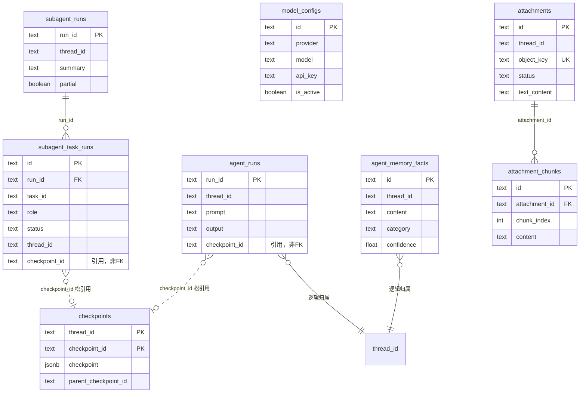

# Agent 项目 PostgreSQL 表结构详解与设计指南

> **文档信息**
>
> | 字段 | 值 |
> |------|-----|
> | 创建日期 | 2026-06-09 |
> | 数据库 | PostgreSQL 16（`intelligent_agent`） |
> | Schema 来源 | `backend/agent-backend-ts/prisma/schema.prisma` |
> | 目标读者 | 想理解本项目存储设计、或准备自建 Agent 项目的开发者 |

---

## 目录

1. [总览：这个项目 PostgreSQL 里有什么？](#1-总览这个项目-postgresql-里有什么)
2. [两类表的治理方式](#2-两类表的治理方式)
3. [业务表详解（Prisma 管理）](#3-业务表详解prisma-管理)
4. [LangGraph Checkpoint 表（框架自动创建）](#4-langgraph-checkpoint-表框架自动创建)
5. [表关系 ER 图](#5-表关系-er-图)
6. [谁写入、谁读取？数据流全景](#6-谁写入谁读取数据流全景)
7. [thread_id 贯穿全库的设计](#7-thread_id-贯穿全库的设计)
8. [自建 Agent 项目：如何考虑表设计](#8-自建-agent-项目如何考虑表设计)
9. [最小可行 Schema vs 完整 Schema](#9-最小可行-schema-vs-完整-schema)
10. [常见误区与最佳实践](#10-常见误区与最佳实践)
11. [附录：字段速查与 SQL 示例](#11-附录字段速查与-sql-示例)

---

## 1. 总览：这个项目 PostgreSQL 里有什么？

本项目所有持久化数据落在 **同一个 PostgreSQL 数据库**（`intelligent_agent`），但表分属**两套管理体系**：

```
PostgreSQL (intelligent_agent)
│
├── 【业务表】Prisma schema 管理，make db-push-ts 推送
│   ├── agent_runs              单次 Agent 运行记录（审计/查询）
│   ├── agent_memory_facts      线程级结构化记忆
│   ├── subagent_runs           子代理运行汇总
│   ├── subagent_task_runs      子代理各子任务明细
│   ├── model_configs           LLM 模型配置（apiKey/baseUrl）
│   ├── attachments             附件元数据
│   └── attachment_chunks       附件分块（检索用）
│
└── 【框架表】LangGraph PostgresSaver.setup() 自动创建
    ├── checkpoints             图状态快照主表
    ├── checkpoint_blobs        大体积 channel 数据
    └── checkpoint_writes       任务级中间写入
```

**不在 PostgreSQL 里的数据：**

| 存储 | 技术 | 用途 |
|------|------|------|
| 运行结果缓存 | Redis | 相同 prompt 120s 内直接返回 |
| 异步任务队列 | Redis（BullMQ） | agent-run / subrun / attachment job |
| 附件文件本体 | S3/MinIO | 二进制文件存储 |

---

## 2. 两类表的治理方式

理解「谁建表、谁迁移」是设计自己项目时的第一个决策。

| 维度 | 业务表（Prisma） | Checkpoint 表（LangGraph） |
|------|------------------|---------------------------|
| **定义位置** | `prisma/schema.prisma` | LangGraph 库内部 |
| **建表方式** | `prisma db push` / migrate | `PostgresSaver.setup()` 首次启动 |
| **列类型** | 常规 TEXT/JSONB/TIMESTAMPTZ | 含 BYTEA 二进制 blob |
| **能否用 Prisma 查询** | ✅ 可以 | ❌ 不建议，应走 Checkpointer API |
| **数据性质** | 业务审计、配置、用户数据 | 图运行时状态（messages 等） |
| **删除策略** | 业务逻辑控制 | 框架管理，勿手动改 |

Prisma schema 中的注释已明确说明：

```prisma
// Note: checkpoint tables are managed by LangGraph's PostgresSaver.setup()
// They are NOT in this Prisma schema because they use different column types (BYTEA, etc.)
```

---

## 3. 业务表详解（Prisma 管理）

### 3.1 `agent_runs` — 单次运行记录

**作用：** 记录每一次 Agent 执行的**业务摘要**，供 `GET /v1/runs/:runId` 查询、审计和前端 Run 列表展示。

**它不是完整对话历史**——完整 messages 在 LangGraph checkpoint 里。

| 字段 | 类型 | 说明 |
|------|------|------|
| `run_id` | TEXT PK | 运行 ID，如 `nest-1717920000000`、`job-1-1717920000000` |
| `thread_id` | TEXT | 所属对话线程 |
| `prompt` | TEXT | 本轮用户输入（最后一条消息） |
| `output` | TEXT | Agent 最终输出文本 |
| `provider` | TEXT | 使用的 LLM 提供商，默认 `qwen` |
| `model` | TEXT? | 模型名，可空 |
| `checkpoint_id` | TEXT? | **引用** LangGraph 最新 checkpoint，非外键 |
| `created_at` | TIMESTAMPTZ | 创建时间 |

**索引：** `(thread_id, created_at)` — 按线程查历史 run。

**写入时机：**

- 同步 `AgentService.run()` 完成后
- SSE `runStream()` 收到 `run_end` 后
- BullMQ Worker `handleJob()` 完成后

**设计意图：**

```
agent_runs = 「这次 run 发生了什么」的业务日志
checkpoint   = 「对话状态恢复到哪」的技术存档
```

两者通过 `checkpoint_id` 松耦合关联，不做数据库级外键。

---

### 3.2 `agent_memory_facts` — 结构化记忆

**作用：** 存储线程级的**长期记忆事实**，每次 Agent 调用前注入 Prompt。

| 字段 | 类型 | 说明 |
|------|------|------|
| `id` | TEXT PK | UUID |
| `thread_id` | TEXT | 所属线程 |
| `content` | TEXT | 记忆内容，如「用户偏好 TypeScript」 |
| `category` | TEXT | 分类，默认 `context` |
| `confidence` | FLOAT | 置信度 0~1，默认 0.7 |
| `metadata` | JSONB | 扩展元数据 |
| `created_at` | TIMESTAMPTZ | 创建时间 |
| `updated_at` | TIMESTAMPTZ | 更新时间 |

**索引：** `(thread_id, created_at DESC)` — 按线程取最近 N 条。

**写入方式：**

1. Agent 调用 `remember_fact` 工具（自动）
2. HTTP `POST /v1/threads/:id/memory/facts`（手动）
3. `PrismaMemoryStore.createFact()`（Backend 适配层）

**读取方式：**

- 每次 `AgentCore.invoke()` 前：`MemoryStore.renderPromptContext(threadId)`
- HTTP `GET /v1/threads/:id/memory`

**Prompt 注入示例：**

```
Known memory facts:
- [context] 用户偏好 TypeScript
- [project] 当前项目是 agent_mono
```

---

### 3.3 `subagent_runs` + `subagent_task_runs` — 子代理运行

多 Agent 协作时，一次 `invokeSubagents` 产生一条主记录 + 多条子任务记录。

#### `subagent_runs`（主表）

| 字段 | 类型 | 说明 |
|------|------|------|
| `run_id` | TEXT PK | 子代理运行 ID，如 `subrun-1717920000000` |
| `thread_id` | TEXT | 主线程 ID |
| `prompt` | TEXT? | 用户原始目标（可空，若直接传 tasks） |
| `summary` | TEXT | Supervisor 汇总后的最终总结 |
| `partial` | BOOLEAN | 是否有子任务失败（降级运行） |
| `created_at` | TIMESTAMPTZ | 创建时间 |
| `updated_at` | TIMESTAMPTZ | 更新时间 |

**索引：** `(thread_id, created_at)`

#### `subagent_task_runs`（子表）

| 字段 | 类型 | 说明 |
|------|------|------|
| `id` | TEXT PK (cuid) | 行 ID |
| `run_id` | TEXT FK → `subagent_runs` | 所属子代理 run |
| `task_id` | TEXT | 任务 ID，如 `task-1` |
| `role` | TEXT | `planner` / `researcher` / `coder` |
| `status` | TEXT | `succeeded` / `failed` / `timed_out` |
| `thread_id` | TEXT | 子任务独立 subThreadId |
| `provider` / `model` | TEXT? | 该任务使用的模型 |
| `output` | TEXT? | 子任务输出 |
| `error` | TEXT? | 失败原因 |
| `checkpoint_id` | TEXT? | 子任务 checkpoint 引用 |
| `started_at` / `ended_at` | TIMESTAMPTZ | 起止时间 |
| `duration_ms` | INT | 耗时毫秒 |

**约束：**

- `UNIQUE(run_id, task_id)` — 同一 run 内 task 不重复
- `ON DELETE CASCADE` — 删主记录时级联删子任务

**关系示意：**

```
subagent_runs (1) ──────< (N) subagent_task_runs
     run_id                    run_id (FK)
```

---

### 3.4 `model_configs` — LLM 模型配置

**作用：** 在 Web 控制台动态管理 Provider，不必改 `.env`。

| 字段 | 类型 | 说明 |
|------|------|------|
| `id` | TEXT PK (cuid) | 配置 ID |
| `name` | TEXT | 显示名称，如「我的 DeepSeek」 |
| `provider` | TEXT | 提供商标识：`qwen` / `glm` / `deepseek` / `openai` / 自定义 |
| `model` | TEXT | 模型 ID，如 `qwen-plus` |
| `api_key` | TEXT | API 密钥（⚠️ 生产应加密） |
| `base_url` | TEXT | API 地址 |
| `is_active` | BOOLEAN | 是否当前激活（全局仅一个 true） |
| `is_custom` | BOOLEAN | 是否非内置 Provider |
| `created_at` / `updated_at` | TIMESTAMPTZ | 时间戳 |

**约束：** `UNIQUE(provider, name)` — 同 Provider 下名称不重复。

**使用链路：**

```
请求未指定 provider/model
    → getActiveModelConfig() 查 is_active=true
    → 注入 providerConfigs { apiKey, baseUrl, model }
    → AgentCore.createRoutedModel()
```

---

### 3.5 `attachments` + `attachment_chunks` — 附件与检索

支持上传 PDF/Word/图片/代码文件，异步解析后供 Agent 检索。

#### `attachments`（主表）

| 字段 | 类型 | 说明 |
|------|------|------|
| `id` | TEXT PK (cuid) | 附件 ID |
| `thread_id` | TEXT? | 关联线程（可选） |
| `run_id` | TEXT? | 关联 run（可选） |
| `file_name` | TEXT | 原始文件名 |
| `content_type` | TEXT | MIME 类型 |
| `size_bytes` | INT | 文件大小 |
| `storage_provider` | TEXT | 默认 `s3` |
| `bucket` | TEXT | 对象存储桶 |
| `object_key` | TEXT UNIQUE | S3/MinIO 对象键 |
| `sha256` | TEXT | 文件哈希（去重） |
| `status` | TEXT | 状态机（见下） |
| `error` | TEXT? | 处理失败原因 |
| `parser` | TEXT? | 使用的解析器 |
| `text_content` | TEXT? | 提取的全文 |
| `metadata` | JSONB | 扩展信息 |
| `created_at` / `updated_at` | TIMESTAMPTZ | 时间戳 |

**status 状态流转：**

```
uploaded → processing → processed
                    ↘ failed（error 字段记录原因）
```

**索引：** `(thread_id, created_at DESC)`、`(run_id)`

#### `attachment_chunks`（分块表）

| 字段 | 类型 | 说明 |
|------|------|------|
| `id` | TEXT PK (cuid) | 分块 ID |
| `attachment_id` | TEXT FK → `attachments` | 所属附件 |
| `thread_id` | TEXT? | 冗余线程 ID，加速检索 |
| `chunk_index` | INT | 分块序号（从 0 开始） |
| `content` | TEXT | 分块文本 |
| `token_count` | INT | 估算 token 数 |
| `created_at` | TIMESTAMPTZ | 创建时间 |

**约束：**

- `UNIQUE(attachment_id, chunk_index)`
- `ON DELETE CASCADE`

**设计原因：** 大文件不能整段塞进 Prompt，分块后支持 `GET /v1/attachments/search?q=...` 全文检索，Agent 可按需引用相关片段。

---

## 4. LangGraph Checkpoint 表（框架自动创建）

当 `AGENT_CHECKPOINTER_BACKEND=postgres` 且 Backend 启动时，`PostgresSaver.setup()` 自动建表。

**源码入口：**

```typescript
// core/agent-core-ts/ts/checkpointer.ts
const saver = PostgresSaver.fromConnString(connectionString);
await saver.setup();  // 创建下面三张表
```

### 4.1 `checkpoints` — 状态快照主表

| 字段 | 类型 | 说明 |
|------|------|------|
| `thread_id` | TEXT | 对话线程（= 项目的 threadId） |
| `checkpoint_ns` | TEXT | 命名空间，默认 `''` |
| `checkpoint_id` | TEXT | 快照 ID |
| `parent_checkpoint_id` | TEXT? | 父快照，形成链表 |
| `type` | TEXT? | 快照类型 |
| `checkpoint` | JSONB | 核心状态（含 channel_values、ts、versions_seen 等） |
| `metadata` | JSONB | 元数据 |

**主键：** `(thread_id, checkpoint_ns, checkpoint_id)`

**checkpoint JSONB 里通常有什么：**

```json
{
  "v": 4,
  "ts": "2026-06-09T10:00:00.000Z",
  "id": "00000000-0000-0000-0000-000000000001",
  "channel_values": {
    "messages": [ /* HumanMessage, AIMessage, ToolMessage... */ ]
  },
  "channel_versions": { ... },
  "versions_seen": { ... }
}
```

**多轮对话如何工作：**

```
第 1 轮 invoke(thread_id="conv-001")
  → 写入 checkpoint-1（messages: [用户:你好, AI:你好]）

第 2 轮 invoke(thread_id="conv-001")
  → 读取 checkpoint-1 恢复 state
  → 追加新消息，写入 checkpoint-2（parent = checkpoint-1）
```

### 4.2 `checkpoint_blobs` — 大体积数据

| 字段 | 类型 | 说明 |
|------|------|------|
| `thread_id` | TEXT | 线程 |
| `checkpoint_ns` | TEXT | 命名空间 |
| `channel` | TEXT | channel 名（如 `messages`） |
| `version` | TEXT | 版本号 |
| `type` | TEXT | 序列化类型 |
| `blob` | BYTEA | 二进制数据 |

**主键：** `(thread_id, checkpoint_ns, channel, version)`

当 channel 值过大时，从 `checkpoints` JSONB 拆出存到这里。

### 4.3 `checkpoint_writes` — 中间写入

| 字段 | 类型 | 说明 |
|------|------|------|
| `thread_id` | TEXT | 线程 |
| `checkpoint_ns` | TEXT | 命名空间 |
| `checkpoint_id` | TEXT | 关联 checkpoint |
| `task_id` | TEXT | 图节点任务 ID |
| `idx` | INT | 写入序号 |
| `channel` | TEXT | channel 名 |
| `type` | TEXT? | 类型 |
| `blob` | BYTEA | 写入内容 |
| `task_path` | TEXT | 任务路径 |

**主键：** `(thread_id, checkpoint_ns, checkpoint_id, task_id, idx)`

用于 ReAct 循环中节点间的 pending writes，支持中断恢复。

### 4.4 如何查询 Checkpoint 数据？

**不要直接 SQL 查这三张表。** 应通过 Core API：

```typescript
listThreads(checkpointer, limit)
getThread(checkpointer, threadId)
getLatestCheckpointId(checkpointer, threadId)
```

HTTP 暴露为 `GET /v1/threads`、`GET /v1/threads/:id/checkpoints`。

---

## 5. 表关系 ER 图



**关键观察：**

- 没有 `threads` 表——`thread_id` 是**逻辑标识**，首次出现在 checkpoint 或 run 记录中
- `checkpoint_id` 在各业务表中是**软引用**，非数据库外键
- 子代理和附件表有真正的 FK + CASCADE

---

## 6. 谁写入、谁读取？数据流全景

### 6.1 一次同步 Agent 调用的写库路径

```
POST /v1/agents/runs
    │
    ├─► LangGraph PostgresSaver
    │     checkpoints / checkpoint_blobs / checkpoint_writes
    │     （自动，每次 invoke 后）
    │
    ├─► agent_runs
    │     DatabaseService.appendRunRecord()
    │     （含 checkpoint_id 引用）
    │
    └─► agent_memory_facts（仅当 Agent 调用 remember_fact 工具时）
          PrismaMemoryStore.createFact()
```

### 6.2 各表读写矩阵

| 表 | 写入方 | 读取方 | API |
|----|--------|--------|-----|
| `checkpoints` * | LangGraph | Core `listThreads/getThread` | `GET /v1/threads/*` |
| `agent_runs` | AgentService / Worker | DatabaseService.getRun | `GET /v1/runs/:id` |
| `agent_memory_facts` | MemoryStore / HTTP | MemoryStore / HTTP | `GET/POST/DELETE .../memory` |
| `subagent_runs` | Worker.handleSubrunJob | DatabaseService.getSubagentRun | Subagent API |
| `subagent_task_runs` | 同上 | 同上 | 同上 |
| `model_configs` | ModelConfigService | getActiveModelConfig | `GET /v1/model-configs` |
| `attachments` | AttachmentService | AttachmentService | `GET /v1/attachments` |
| `attachment_chunks` | 解析 Worker | 全文检索 | `GET /v1/attachments/search` |

\* 含 blobs / writes 子表

---

## 7. `thread_id` 贯穿全库的设计

`thread_id` 是本项目的**核心关联键**，但不是数据库外键：

```
thread_id: "conv-001"
    │
    ├── checkpoints.*           完整对话状态（技术层）
    ├── agent_runs.*            每次 run 的业务记录
    ├── agent_memory_facts.*    长期记忆
    ├── subagent_runs.*         子代理主记录
    ├── subagent_task_runs.*    子任务（含 subThreadId 变体）
    └── attachments.*           可选关联
```

**子代理的 thread_id 变体：**

```
主线程:     conv-001
子任务 1:   conv-001:sub:subrun-123:task-1
子任务 2:   conv-001:sub:subrun-123:task-2
```

每个 subThreadId 在 checkpoint 表中有独立的状态链。

**设计启示：** 自建项目时，`thread_id` 建议：

- 客户端生成或服务端分配，**多轮必须复用**
- 用字符串而非自增 ID，便于分布式生成
- 子任务可用 `{parent}:sub:{runId}:{taskId}` 命名空间隔离

---

## 8. 自建 Agent 项目：如何考虑表设计

### 8.1 先回答三个问题

| 问题 | 影响 |
|------|------|
| 需要多轮对话吗？ | 需要 → Checkpointer（LangGraph 或自研 state 表） |
| 需要长期记忆吗？ | 需要 → memory_facts 表，与 checkpoint 分开 |
| 需要运行审计吗？ | 需要 → runs 业务表，记录 prompt/output |

### 8.2 推荐的存储分层（借鉴本项目）

```
┌─────────────────────────────────────────────────────────┐
│  Layer 1: 运行时状态（Framework 管）                       │
│  → LangGraph checkpoints                                 │
│  职责：messages 恢复、图 state、中断恢复                    │
│  特点：框架自动读写，业务层不直接 SQL                      │
└─────────────────────────────────────────────────────────┘
                          ↕ thread_id（逻辑关联）
┌─────────────────────────────────────────────────────────┐
│  Layer 2: 业务数据（你的 ORM 管）                          │
│  → runs、memory、configs、attachments                    │
│  职责：审计、配置、用户可见数据、检索                       │
│  特点：Prisma/SQLAlchemy 管理，HTTP API 直接查            │
└─────────────────────────────────────────────────────────┘
                          ↕
┌─────────────────────────────────────────────────────────┐
│  Layer 3: 热数据缓存（Redis）                             │
│  → 结果缓存、BullMQ 队列                                  │
│  职责：加速、异步解耦，可丢可重建                          │
└─────────────────────────────────────────────────────────┘
                          ↕
┌─────────────────────────────────────────────────────────┐
│  Layer 4: 大文件（对象存储）                               │
│  → S3/MinIO                                              │
│  职责：二进制附件，DB 只存元数据和提取文本                   │
└─────────────────────────────────────────────────────────┘
```

### 8.3 表设计决策清单

#### ✅ 建议做的

1. **分开「状态」和「记忆」**
   - Checkpoint = 完整对话快照（自动、庞大、框架管）
   - Memory = 提炼后的事实（手动/工具写入、精简、业务管）

2. **runs 表做业务审计，不做状态恢复**
   - 存 prompt + output + checkpoint_id 引用
   - 前端 Run 历史列表查这张表，比扫 checkpoint 快

3. **thread_id 用逻辑键，不建 threads 主表（初期）**
   - 本项目没有 `threads` 表，线程元数据从 checkpoint 聚合
   - 后期如需 title、user_id，再加 `threads` 表

4. **model_configs 与 .env 双轨**
   - 开发用环境变量，生产用 DB 动态配置
   - `is_active` 保证全局只有一个激活配置

5. **附件：元数据入库，文件入对象存储，文本分块**
   - DB 不存二进制
   - chunks 表支持检索和 RAG

6. **子代理：主从表拆分**
   - 主表存 summary，子表存每个 task 的 output/error/duration
   - 便于展示并行任务进度

#### ❌ 不建议做的

1. **用 runs 表存完整 messages 替代 checkpoint**
   - messages 含 tool calls、多模态，结构复杂
   - 恢复 state 需要框架级序列化，交给 LangGraph

2. **把 memory_facts 和 checkpoint 合并**
   - 用途不同：memory 是精选事实，checkpoint 是原始对话
   - 合并后 Prompt 膨胀、难以管理

3. **checkpoint 表纳入 Prisma migrate**
   - BYTEA 列、框架内部迁移，强行纳入会冲突
   - 保持「框架表」与「业务表」治理分离

4. **所有表都加 thread_id 外键**
   - thread 可能只存在于 checkpoint 中，尚无主表
   - 软关联 + 索引足够

### 8.4 技术选型对应

| 你的选择 | 表设计影响 |
|----------|-----------|
| LangGraph + PostgresSaver | 自动有 3 张 checkpoint 表，无需自建 state 表 |
| 纯 LangChain（无 LangGraph） | 需自建 `conversations` + `messages` 表 |
| 无状态 Agent（每次传全量 history） | 只需 runs 表，可不建 checkpoint |
| 加 RAG | 加 `documents` + `chunks` + 向量索引（本项目用 PG 全文，未用 pgvector） |
| 多租户 | 所有表加 `user_id` / `tenant_id`，thread_id 命名空间隔离 |

---

## 9. 最小可行 Schema vs 完整 Schema

### 9.1 最小可行（MVP Agent）

适合：个人项目、PoC、无多轮/无附件。

```sql
-- 运行记录（必需）
CREATE TABLE agent_runs (
  run_id      TEXT PRIMARY KEY,
  thread_id   TEXT NOT NULL,
  prompt      TEXT NOT NULL,
  output      TEXT NOT NULL,
  provider    TEXT NOT NULL DEFAULT 'openai',
  created_at  TIMESTAMPTZ NOT NULL DEFAULT now()
);
CREATE INDEX idx_runs_thread ON agent_runs(thread_id, created_at);

-- 可选：记忆
CREATE TABLE agent_memory_facts (
  id          TEXT PRIMARY KEY,
  thread_id   TEXT NOT NULL,
  content     TEXT NOT NULL,
  created_at  TIMESTAMPTZ NOT NULL DEFAULT now()
);

-- 多轮对话：用 LangGraph PostgresSaver.setup() 自动建 checkpoint 表
-- 或 MVP 阶段每次客户端传全量 messages，暂不建 checkpoint
```

### 9.2 本项目完整 Schema（生产级）

| 表 | MVP 需要？ | 本项目 |
|----|-----------|--------|
| checkpoint 三表 | 多轮对话需要 | ✅ LangGraph 自动 |
| `agent_runs` | ✅ | ✅ |
| `agent_memory_facts` | 推荐 | ✅ |
| `model_configs` | 有控制台时需要 | ✅ |
| `subagent_runs` + `task_runs` | 多 Agent 时需要 | ✅ |
| `attachments` + `chunks` | 文件上传/RAG 时需要 | ✅ |

### 9.3 渐进式扩展路线

```
Phase 1: agent_runs + 客户端传 history
    ↓ 需要多轮恢复
Phase 2: + LangGraph PostgresSaver（checkpoint 三表）
    ↓ 需要长期记忆
Phase 3: + agent_memory_facts
    ↓ 需要控制台切模型
Phase 4: + model_configs
    ↓ 需要复杂任务
Phase 5: + subagent_runs / task_runs
    ↓ 需要文档理解
Phase 6: + attachments / chunks + 对象存储
```

---

## 10. 常见误区与最佳实践

### 误区 1：「对话历史 = agent_runs 表」

`agent_runs` 只存每轮的 prompt/output 摘要。完整 messages（含 tool call 往返）在 checkpoint 的 `channel_values.messages` 里。

### 误区 2：「memory 表可以替代 checkpoint」

Memory 是精选事实（「用户叫小明」），无法恢复完整 tool 调用链。两者互补，不能互换。

### 误区 3：「checkpoint_id 是外键」

业务表里的 `checkpoint_id` 只是**引用**，没有 FK 约束。Checkpoint 可能被框架清理，引用会失效。

### 误区 4：「一个数据库一套 ORM 管所有表」

本项目 Prisma 管 7 张业务表，LangGraph 管 3 张框架表，**共存同一 PG 实例**，各管各的。

### 最佳实践

| 实践 | 说明 |
|------|------|
| 索引 thread_id | 几乎所有业务表都按 thread 查询 |
| JSONB 存 metadata | 扩展字段用 JSONB，避免频繁改表 |
| 运行记录 upsert | `run_id` 做主键，Worker 重试不重复插入 |
| api_key 加密 | `model_configs.api_key` 生产环境应加密存储 |
| 附件状态机 | `uploaded → processing → processed` 便于追踪 |
| 分块冗余 thread_id | `attachment_chunks.thread_id` 避免 JOIN 检索 |

---

## 11. 附录：字段速查与 SQL 示例

### 11.1 业务表一览

| 表名 | 主键 | 核心索引 | 记录量级预期 |
|------|------|----------|-------------|
| `agent_runs` | run_id | (thread_id, created_at) | 随调用次数线性增长 |
| `agent_memory_facts` | id | (thread_id, created_at DESC) | 每线程数十~数百条 |
| `subagent_runs` | run_id | (thread_id, created_at) | 少于 agent_runs |
| `subagent_task_runs` | id | (run_id), UNIQUE(run_id, task_id) | 每 subrun 2~8 条 |
| `model_configs` | id | UNIQUE(provider, name) | 个位数~数十条 |
| `attachments` | id | (thread_id, created_at DESC) | 随上传增长 |
| `attachment_chunks` | id | (attachment_id), (thread_id) | 每附件数十~数百块 |

### 11.2 常用查询示例

```sql
-- 某线程最近 10 次 run
SELECT run_id, prompt, left(output, 100) AS output_preview, created_at
FROM agent_runs
WHERE thread_id = 'conv-001'
ORDER BY created_at DESC
LIMIT 10;

-- 某线程记忆事实
SELECT content, category, confidence
FROM agent_memory_facts
WHERE thread_id = 'conv-001'
ORDER BY created_at DESC;

-- 当前激活模型
SELECT provider, model, base_url
FROM model_configs
WHERE is_active = true;

-- 子代理运行及子任务
SELECT r.run_id, r.summary, r.partial,
       t.task_id, t.role, t.status, t.duration_ms
FROM subagent_runs r
JOIN subagent_task_runs t ON t.run_id = r.run_id
WHERE r.thread_id = 'conv-001'
ORDER BY r.created_at DESC;

-- 附件处理状态
SELECT file_name, status, parser, created_at
FROM attachments
WHERE thread_id = 'conv-001'
ORDER BY created_at DESC;

-- Checkpoint 数量（调试用，生产走 API）
SELECT thread_id, count(*) AS checkpoint_count
FROM checkpoints
GROUP BY thread_id
ORDER BY checkpoint_count DESC
LIMIT 20;
```

### 11.3 初始化命令

```bash
# 启动 PostgreSQL
make db-up

# 推送 Prisma 业务表
make db-push-ts
# 等价于：pnpm --filter @tang-agent/agent-backend-ts prisma:push

# 启动 Backend（自动 PostgresSaver.setup() 创建 checkpoint 表）
make dev-api-ts
```

### 11.4 相关文档

| 文档 | 路径 |
|------|------|
| 存储职责边界 | `backend/agent-backend-ts/STORAGE_RESPONSIBILITIES.zh-CN.md` |
| Checkpointer 详解 | `docs/yunfan/2026-06-09-checkpointer-manager-guide.md` |
| Agent Backend 模块 | `docs/yunfan/2026-06-09-agent-backend-module-guide.md` |
| Prisma Schema 源码 | `backend/agent-backend-ts/prisma/schema.prisma` |

---

## 总结：一张图记住全部表

```
                    ┌─────────────────────────────────┐
                    │         thread_id               │
                    │    （逻辑关联键，非 FK）           │
                    └──────────┬──────────────────────┘
           ┌───────────────────┼───────────────────┐
           ▼                   ▼                   ▼
   ┌───────────────┐  ┌───────────────┐  ┌───────────────┐
   │  checkpoints  │  │  agent_runs   │  │ memory_facts  │
   │  (LangGraph)  │  │  (业务审计)    │  │  (长期记忆)    │
   │  完整 state    │  │  prompt/output │  │  精选事实      │
   └───────────────┘  └───────────────┘  └───────────────┘

   ┌───────────────┐  ┌───────────────┐  ┌───────────────┐
   │ model_configs │  │ subagent_runs │  │  attachments  │
   │  (LLM 配置)    │  │  + task_runs  │  │  + chunks     │
   │  全局/控制台   │  │  (多 Agent)    │  │  (文件/RAG)    │
   └───────────────┘  └───────────────┘  └───────────────┘
```

**自建 Agent 的核心原则：**

1. **状态归框架**（checkpoint），**事实归业务**（memory/runs）
2. **先 MVP 后扩展**，按 Phase 1→6 渐进加表
3. **thread_id 统一关联**，子任务用命名空间隔离
4. **大文件不入库**，元数据 + 分块 + 对象存储
5. **两套表治理分离**，不强行把框架表纳入 ORM

---

*本文档基于 2026-06-09 代码库 `prisma/schema.prisma` 与 LangGraph PostgresSaver 文档整理。*
